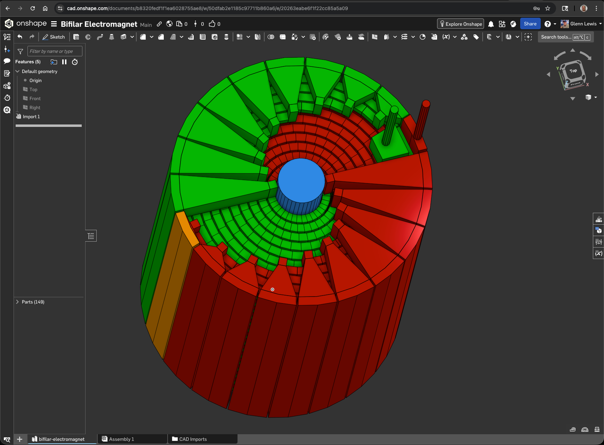

# gmlewis/step (MoonBit)

A high-level 3D modeling DSL and lossless STEP (ISO 10303-21) parser/serializer in MoonBit.

This repo allows you to build 3D models using a simple API and export them to valid,
topologically-sound STEP files.

Onshape design: https://cad.onshape.com/documents/b8320fedf1f1ea6028755ae8/w/50dfab2e1185c97711b860a6/e/20263eabe6f1f22cc85a5a09?renderMode=0&uiState=695414a99e93423471a30e60



*Example 12: The Bifilar Electromagnet, an invention of mine with interesting electrical properties.*

## Quick Start (Modeling)

Building a model is intuitive:

```moonbit
async fn main {
  let design = @cad.Design::new(name="my-model")
    .add(
      @cad.Cuboid::new(20, 20, 20)
        .with_name("base")
        .with_color(@cad.Rgb::orange())
    )
    .add(
      @cad.CalibrationChamferBlock::new(10, 10, 5, chamfer_size_mm=1.0)
        .with_name("top-part")
        .translate(z=20)
    )

  design.write_step(Some("model.step"))
}
```

## Exporting to Blender (Python)

This repo can generate Blender 5.0 Python scripts that recreate your model with correct physical scale. The generated script uses meters (Blender’s default), while your CAD dimensions remain in millimeters.

### From your own model
1. Implement your design in MoonBit (see the modeling example above).
2. Emit Blender Python instead of STEP:

```moonbit
design.write_blender_python(Some("model.py"))
```

3. Open Blender and run the script from the Scripting workspace, or run Blender directly from the command line:

```bash
blender --background --factory-startup --python model.py
```

### From the included examples
Generate Blender scripts and ".blend" files for all examples:

```bash
./scripts/manage_examples.py all --bpy
```

This produces `.py` and `.blend` files in [bpy-out](bpy-out).
Each script removes the default cube (if present), recreates the model, and selects all created geometry.

## Quick Start (Parsing)

Parsing from a string:

```moonbit
fn parse_example(step_text : String) -> Unit {
  match @parse.parse_repository_from_string_result(step_text) {
    @parse.ParseRepositoryResult::Ok(repo) => {
      let normalized = repo.to_step_file()
      println("entities=" + repo.len().to_string())
      println(normalized)
    }
    @parse.ParseRepositoryResult::Err(info) =>
      @cli.eprintln(@parse.format_step_parse_error(info))
  }
}
```

## Features

- **Fluent 3D DSL**: Chain transformations like `.translate()`, `.with_color()`, and `.with_name()`.
- **Lossless Roundtrips**: Unknown/unmodeled entities are preserved during parse/serialize cycles.
- **Robust CLI**: Built-in validation, proper `stderr` reporting, and short-circuiting exit codes.
- **Deterministic**: Serializer output is stable (parse → serialize → parse is idempotent).

## Development & Validation

### Verification
Run the unit tests and formatters:
- `./test-all.sh`

### Geometric Validation & Rendering
We use Open CASCADE (`occt-draw` or `DRAWEXE`) to ensure topological validity and generate previews:
- `./scripts/manage_examples.py all --validate --render --readme`

## Goals

- Provide a pleasant authoring UX for 3D models in MoonBit.
- Parse real-world STEP files without panicking.
- Provide actionable parse errors (line/col + statement snippets).

## License

Apache-2.0

## Status

The code has been updated to support compiler:

```bash
$ moon version --all
moon 0.1.20260110 (0e584ac 2026-01-10) ~/.moon/bin/moon
moonc v0.7.1+adb125543 (2026-01-10) ~/.moon/bin/moonc
moonrun 0.1.20260110 (0e584ac 2026-01-10) ~/.moon/bin/moonrun
moon-pilot 0.0.1-df92511 (2026-01-10) ~/.moon/bin/moon-pilot
```
