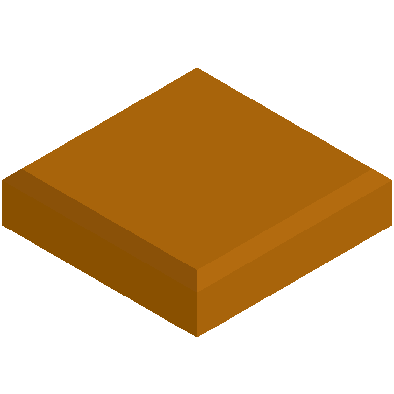
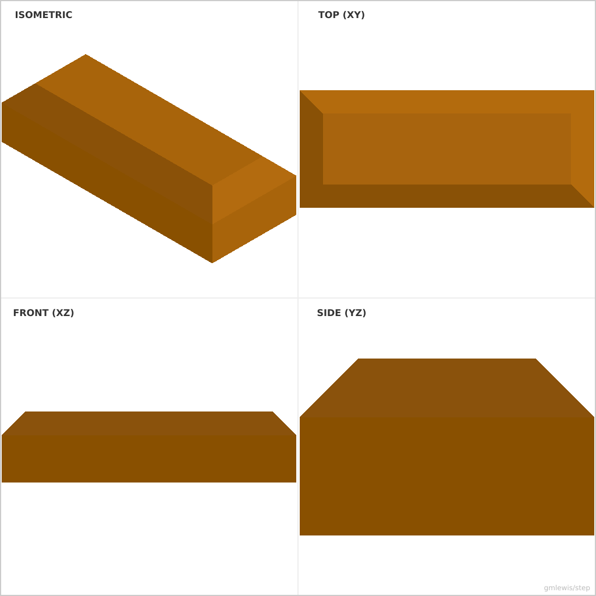
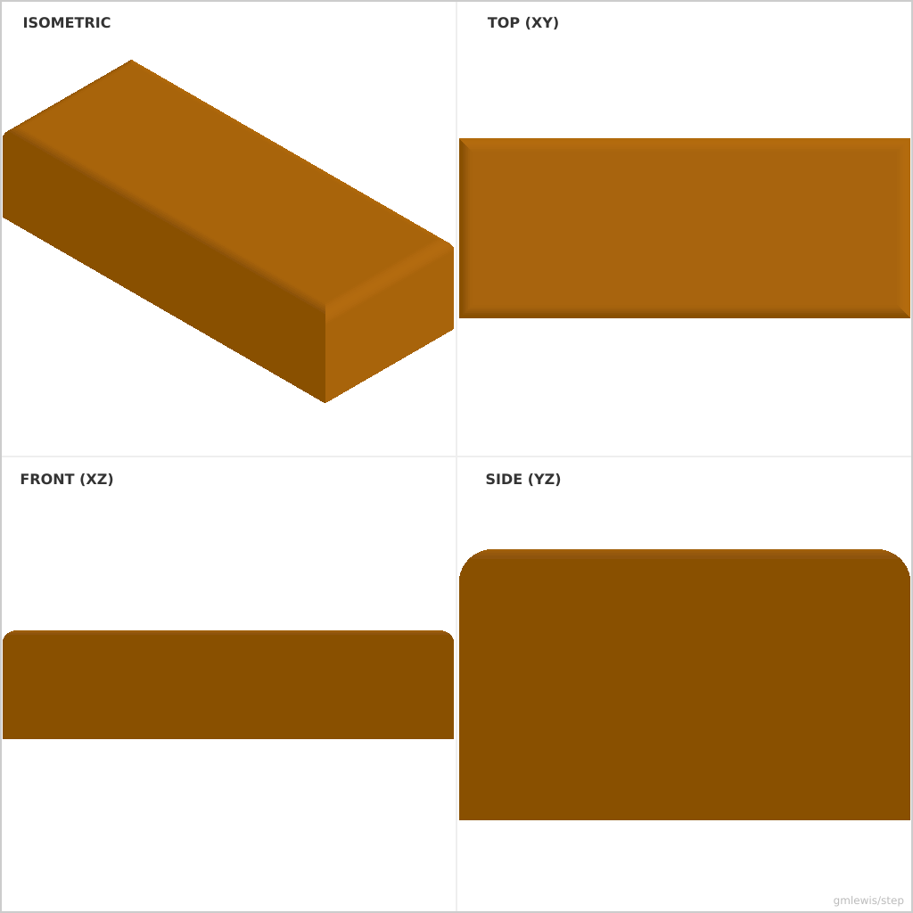

# 02 — Calibration Chamfer Block

This folder contains a **working example** that generates a STEP model for: A print-tuning block that sweeps chamfers/fillets to see what your printer handles.

The intent is that you can run the code here to emit a STEP file, open it in a CAD viewer, and/or import it into your slicer to 3D print and iterate.

## What this example demonstrates
- parametric dimensions as first-class inputs
- exporting a clean STEP solid you can reuse in other tools

## Parameters to try
- `filletRadius`
- `chamferSize`

## Suggested extensions
- add a variant generator (small/medium/large)
- add a quick-print calibration mode

---

### Variant 1

Command line: `./run-example.sh 02 --length 20 --width 20 --height 5`

### Variant 2

Command line: `./run-example.sh 02 --chamferSize 4`

### Variant 3

Command line: `./run-example.sh 02 --filletRadius 1.5`

