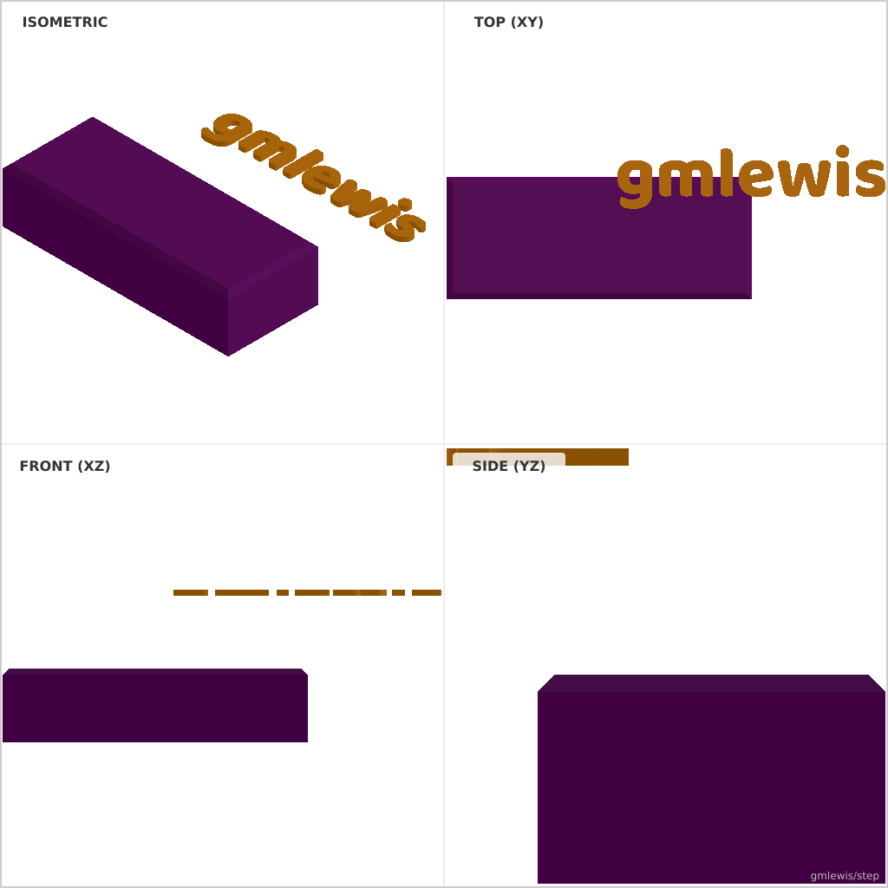
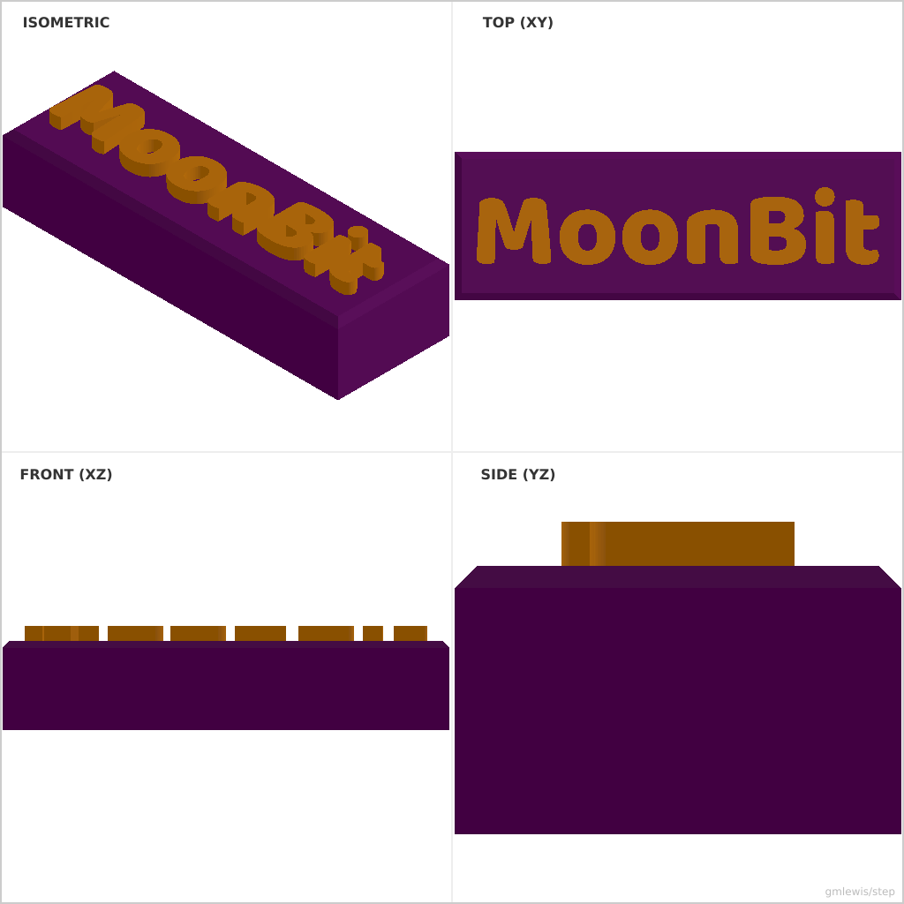

# 03 — Engraved Name Tag

This folder contains a **working example** that generates a STEP model for:
A keychain tag with programmable text placement and border styles.

The intent is that you can run the code here to emit a STEP file, open it in a CAD viewer, and/or import it into your slicer to 3D print and iterate.

## What this example demonstrates
- programmatic text/layout
- consistent engraving/emboss depths
- parametric borders and spacing
- curve-driven geometry

## Parameters to try
- `text`
- `fontSize`
- `embossDepth`
- `toothCount`
- `pitchOrModule`

## Suggested extensions
- add a second font/style variant
- add alignment marks or registration features
- add bearing pockets and shafts

---

### Variant 1

Command line: `./run-example.sh 03 --name gmlewis`

### Variant 2

Command line: `./run-example.sh 03 --name MoonBit --embossDepth 2 --length 60`

