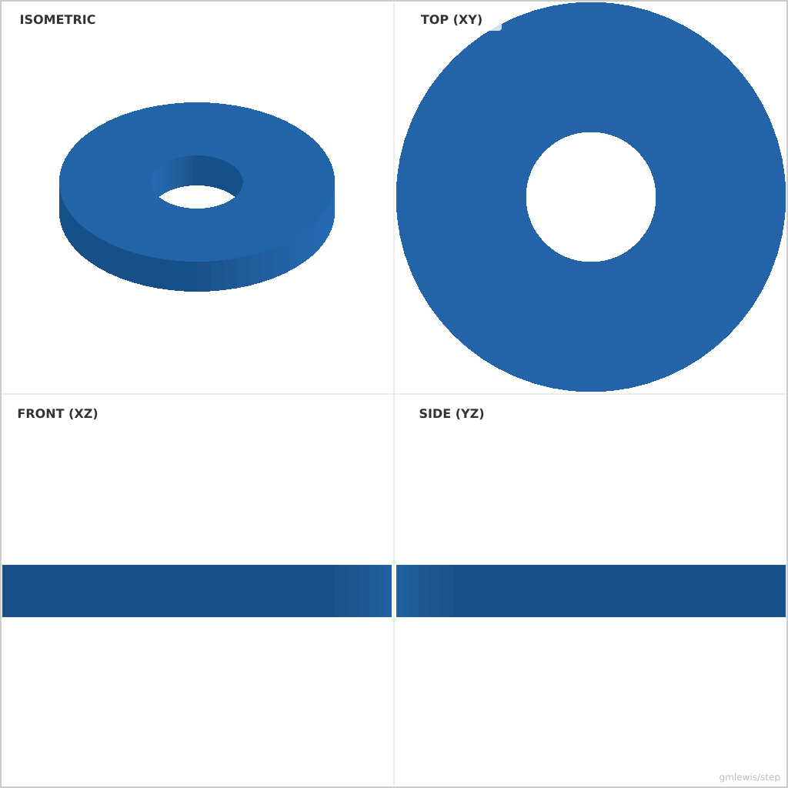
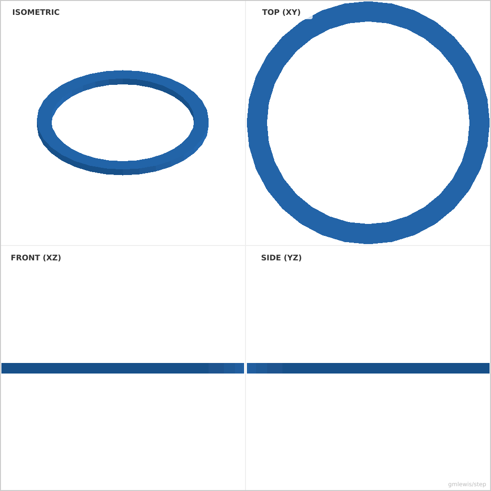

# 04 — Parametric Washer Kit

This folder contains a **working example** that generates a STEP model for: Generate a family of washers from a table of inner/outer diameters and thicknesses.

The intent is that you can run the code here to emit a STEP file, open it in a CAD viewer, and/or import it into your slicer to 3D print and iterate.

## What this example demonstrates
- parametric dimensions as first-class inputs
- exporting a clean STEP solid you can reuse in other tools

## Parameters to try
- `filletRadius`
- `chamferSize`

## Suggested extensions
- add a variant generator (small/medium/large)
- add a quick-print calibration mode

---

### Variant 1

Command line: `./run-example.sh 04 --id 5 --od 15 --thickness 2`

### Variant 2

Command line: `./run-example.sh 04 --id 10 --od 12 --thickness 0.5 --segments 32`

