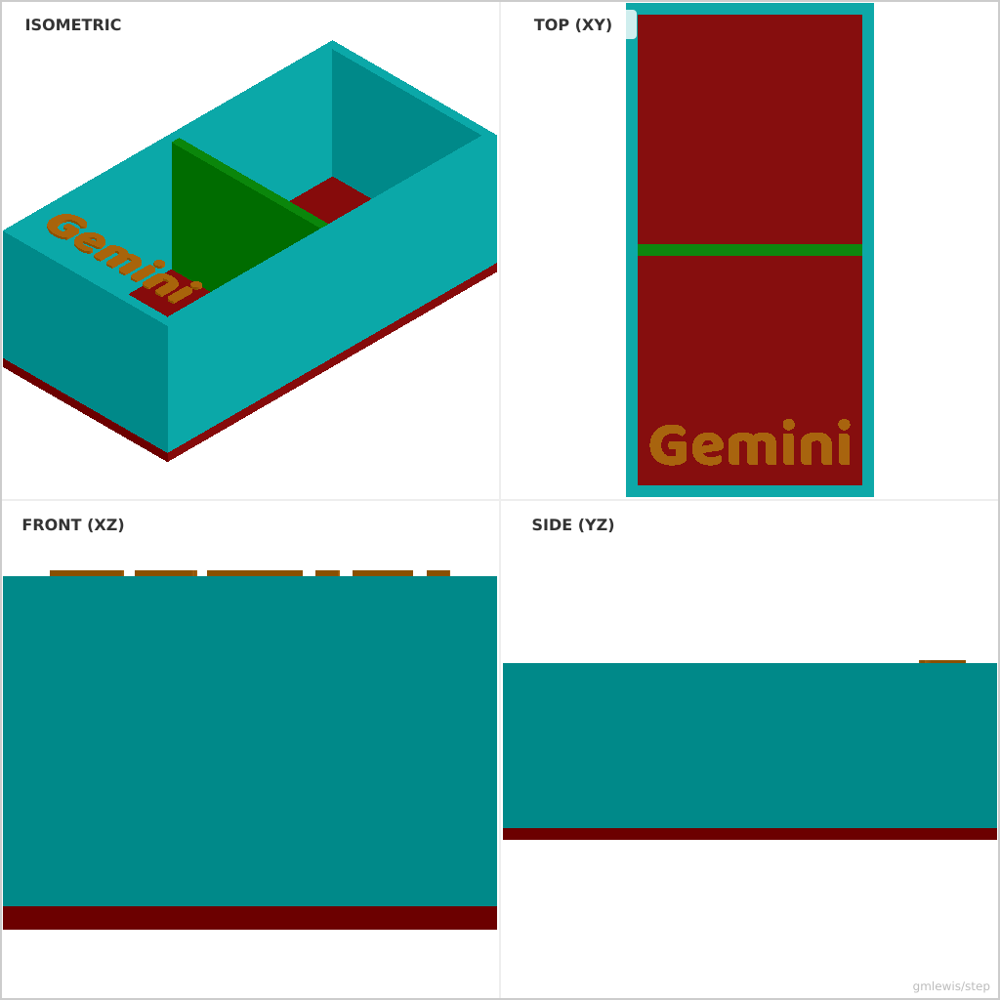

# 05 — Gridfinity Compatible Bin

This folder contains a **working example** that generates a STEP model for: A maker-friendly storage bin generator with configurable compartments and labels.

The intent is that you can run the code here to emit a STEP file, open it in a CAD viewer, and/or import it into your slicer to 3D print and iterate.

## What this example demonstrates
- programmatic text/layout
- consistent engraving/emboss depths
- parametric borders and spacing
- arraying features from data

## Parameters to try
- `text`
- `fontSize`
- `embossDepth`
- `rows`
- `cols`

## Suggested extensions
- add a second font/style variant
- add alignment marks or registration features
- generate multiple sizes in one run

---

### Variant 1

Command line: `./run-example.sh 05 --rows 1 --cols 1 --height 20`

### Variant 2

Command line: `./run-example.sh 05 --rows 2 --cols 1 --text Gemini`

