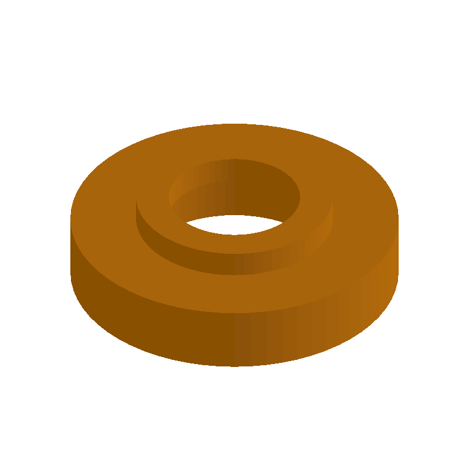
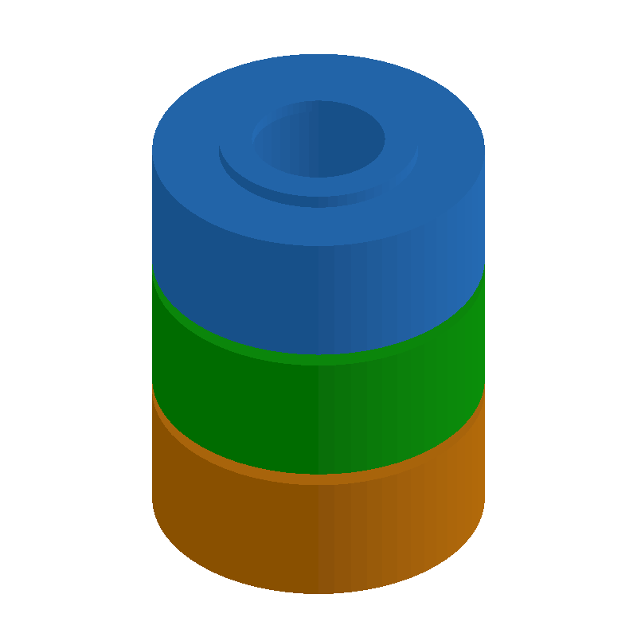

# 06 — Stackable Spacer Tower

This folder contains a **working example** that generates a STEP model for: A set of stackable spacers with “click-together” features for fast height changes.

The intent is that you can run the code here to emit a STEP file, open it in a CAD viewer, and/or import it into your slicer to 3D print and iterate.

## What this example demonstrates
- function-driven surfaces
- parameter sweeps for comparison
- exportable solids for downstream analysis
- parametric dimensions as first-class inputs

## Parameters to try
- `resolution`
- `thickness`
- `scale`
- `filletRadius`
- `chamferSize`

## Suggested extensions
- add a batch runner that emits many variants
- add reference geometry for measurement
- add a variant generator (small/medium/large)

---

### Variant 1

Command line: `./run-example.sh 06 --count 1`

### Variant 2

Command line: `./run-example.sh 06 --count 3 --height 10 --clickHeight 1`

