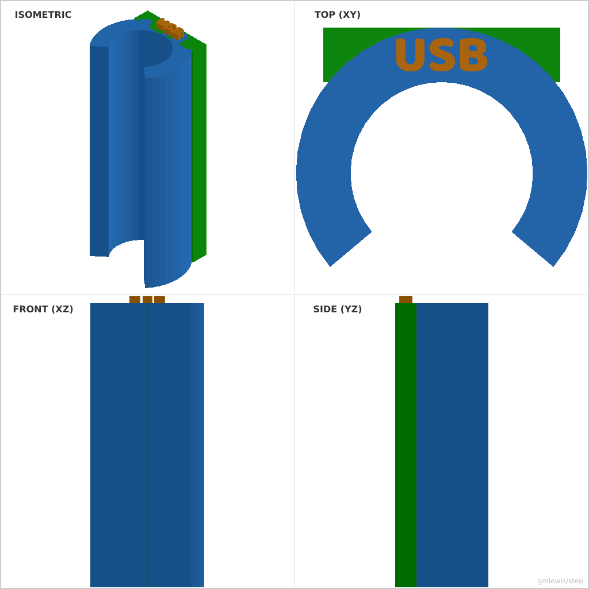
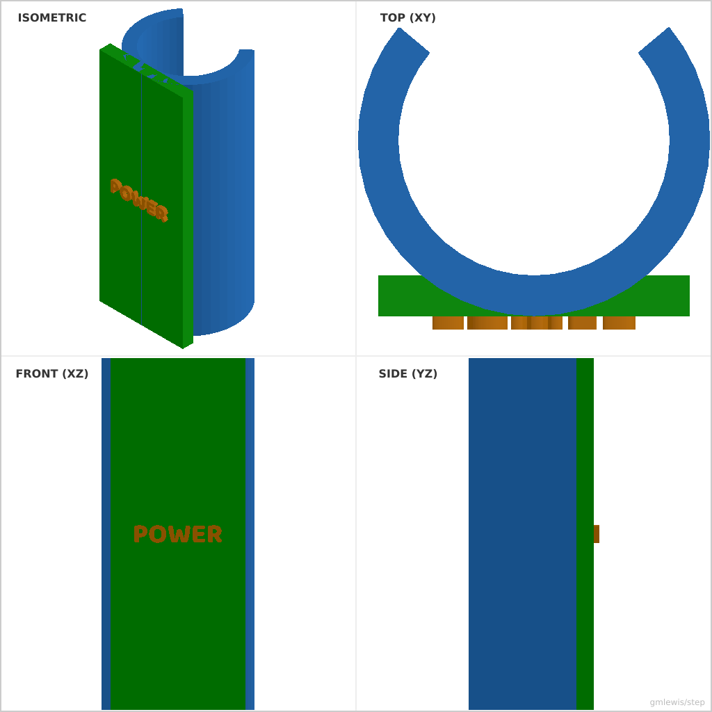

# 07 — Cable Label Clip

This folder contains a **working example** that generates a STEP model for: A snap-on cable label that embeds text and fits multiple cable diameters.

The intent is that you can run the code here to emit a STEP file, open it in a CAD viewer, and/or import it into your slicer to 3D print and iterate.

## What this example demonstrates
- programmatic text/layout
- consistent engraving/emboss depths
- parametric borders and spacing
- tolerance sweeps as code

## Parameters to try
- `text`
- `fontSize`
- `embossDepth`
- `clearance`
- `interference`

## Suggested extensions
- add a second font/style variant
- add alignment marks or registration features
- emit a small “label plaque” with the chosen settings

---

### Variant 1

Command line: `./run-example.sh 07 --diameter 5 --text USB`

### Variant 2

Command line: `./run-example.sh 07 --diameter 10 --text POWER --length 30`

