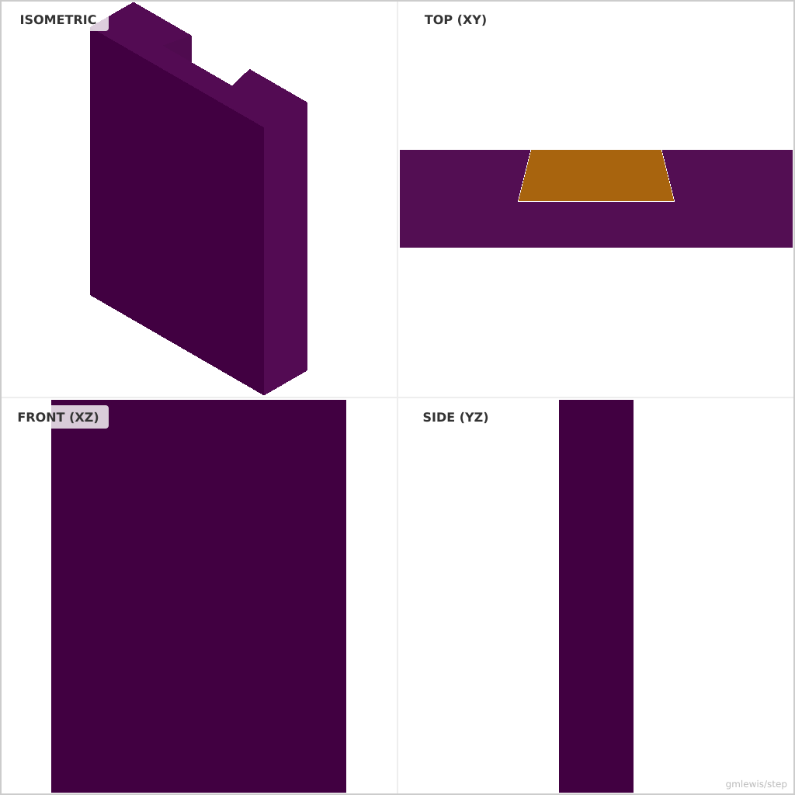
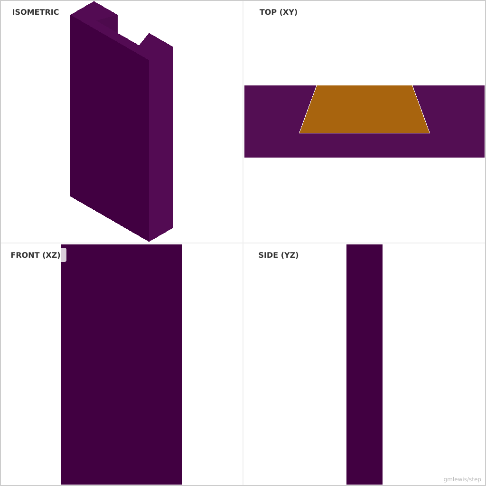
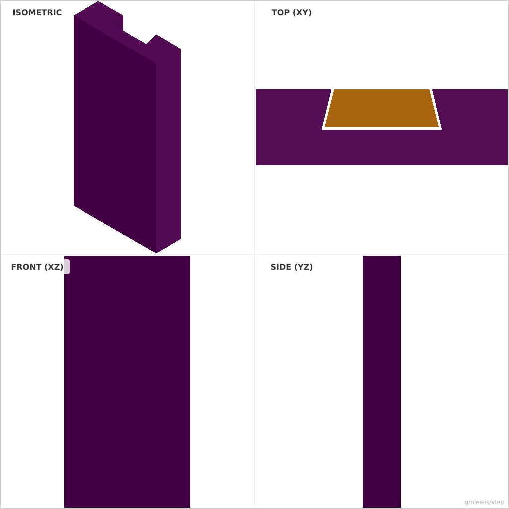

# 09 — Dovetail Slider Jig

This folder contains a **working example** that generates a STEP model for: A dovetail track and mating slider, generated with adjustable clearances.

The intent is that you can run the code here to emit a STEP file, open it in a CAD viewer, and/or import it into your slicer to 3D print and iterate.

## What this example demonstrates
- tolerance sweeps as code
- dimension-driven feature generation
- repeatable measurement artifacts
- arraying features from data

## Parameters to try
- `clearance`
- `interference`
- `stepCount`
- `rows`
- `cols`

## Suggested extensions
- emit a small “label plaque” with the chosen settings
- add a quick-fit calibration part alongside the main part
- generate multiple sizes in one run

---

### Variant 1

Command line: `./run-example.sh 09 --baseWidth 60 --baseLength 80`

### Variant 2

Command line: `./run-example.sh 09 --dovetailAngle 20 --dovetailHeight 10`

### Variant 3

Command line: `./run-example.sh 09 --clearance 0.5`

