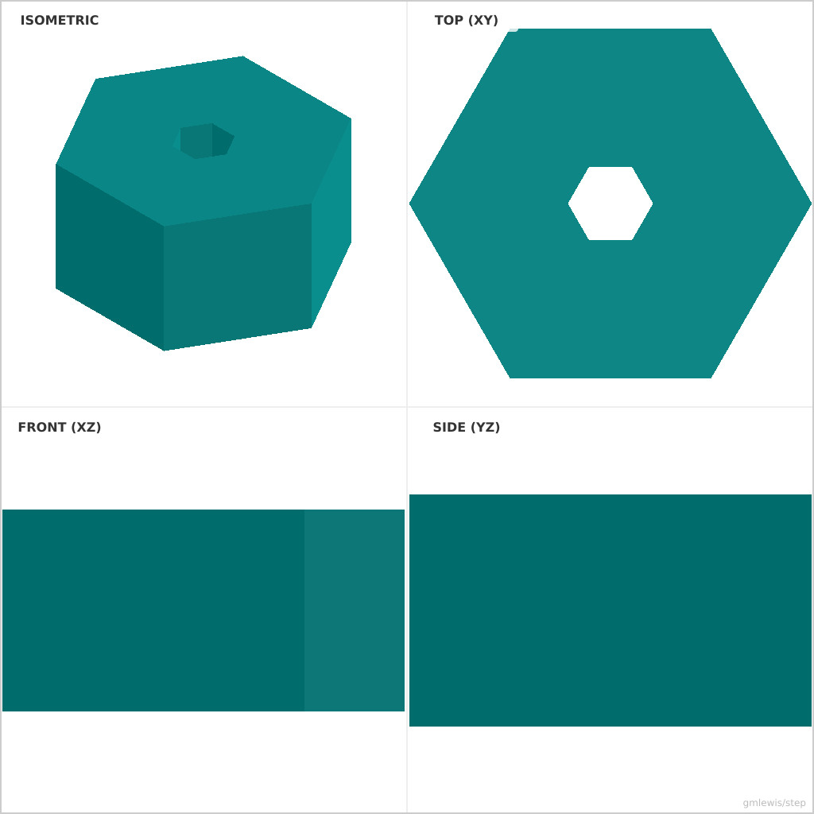
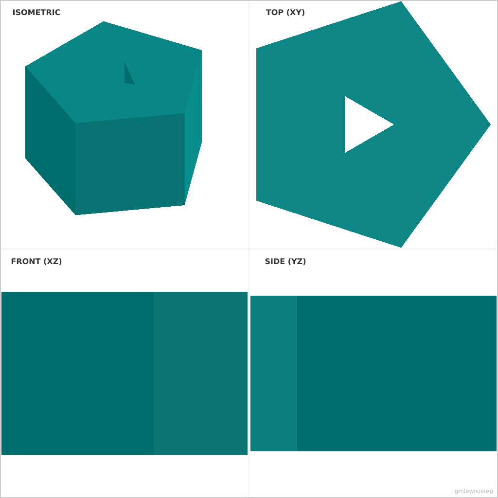
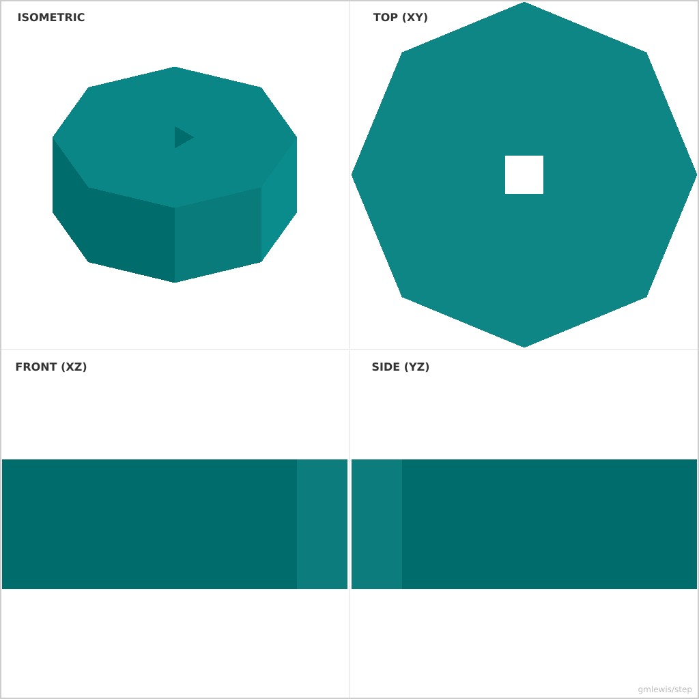

# 10 — Polygon Knob

This folder contains a **working example** that generates a STEP model for: A knob whose profile is driven by a polygon/spline function and grip parameters.

The intent is that you can run the code here to emit a STEP file, open it in a CAD viewer, and/or import it into your slicer to 3D print and iterate.

## What this example demonstrates
- transition solids (inlet→outlet)
- arrays and placement rules
- printability constraints for internal passages
- parametric dimensions as first-class inputs

## Parameters to try
- `inletSize`
- `outletSize`
- `length`
- `filletRadius`
- `chamferSize`

## Suggested extensions
- add mounting flanges and bolt patterns
- add flow-straightening vanes or ribs
- add a variant generator (small/medium/large)

---

### Variant 1

Command line: `./run-example.sh 10 --sides 6 --holeSides 6`

### Variant 2

Command line: `./run-example.sh 10 --sides 5 --holeSides 3 --diameter 25`

### Variant 3

Command line: `./run-example.sh 10 --sides 8 --holeSides 4 --holeRotation 45 --diameter 40`

