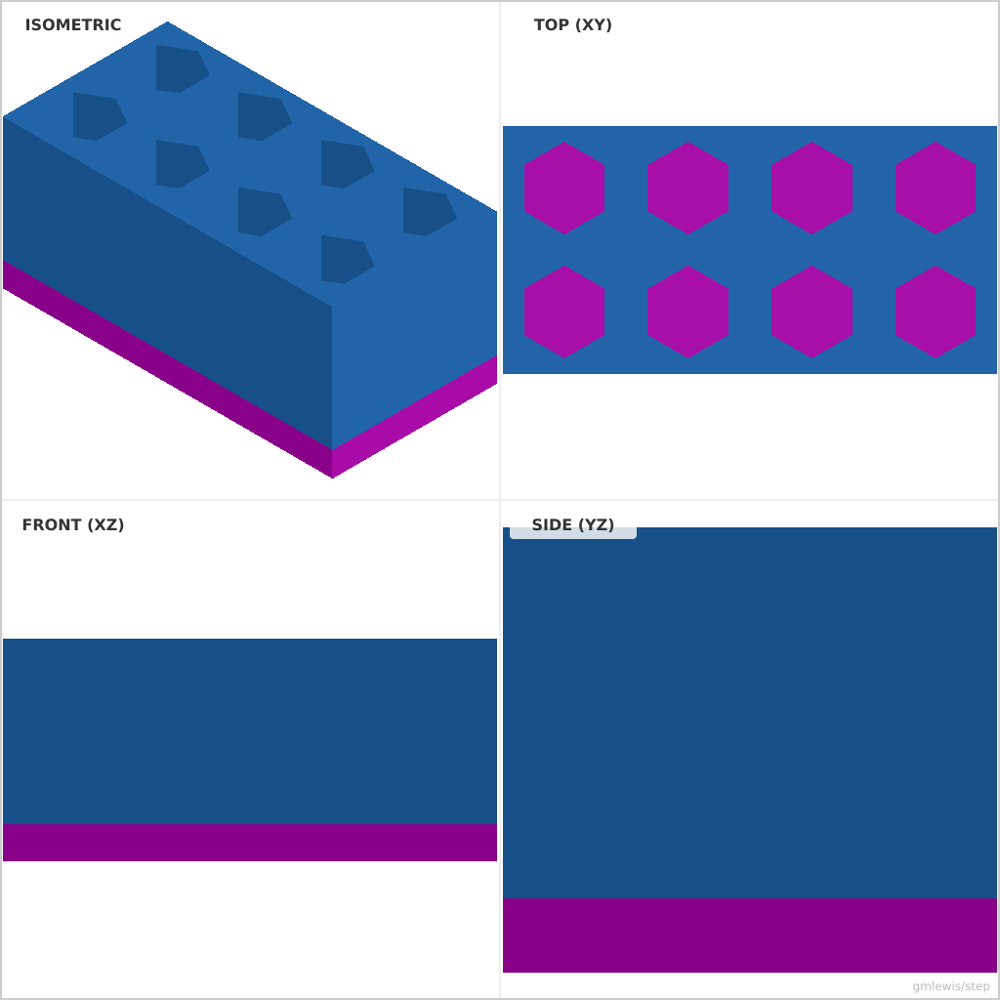
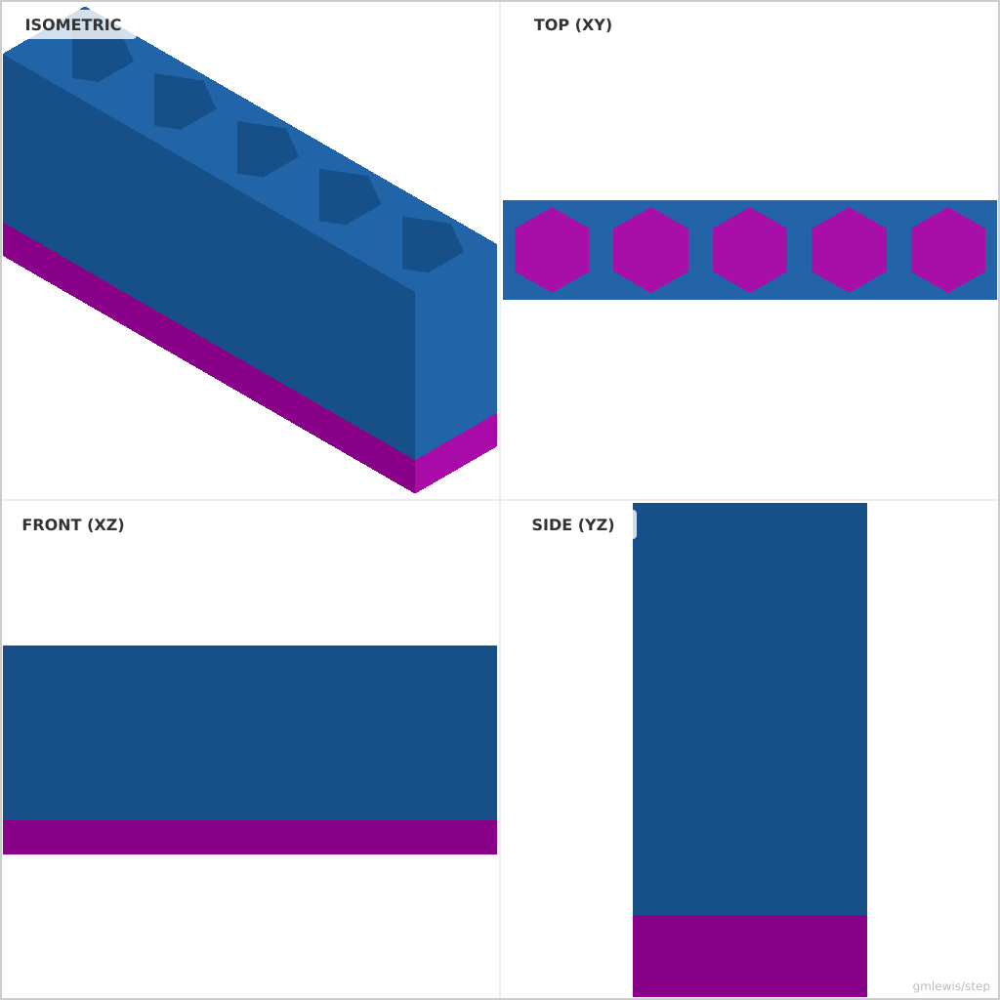
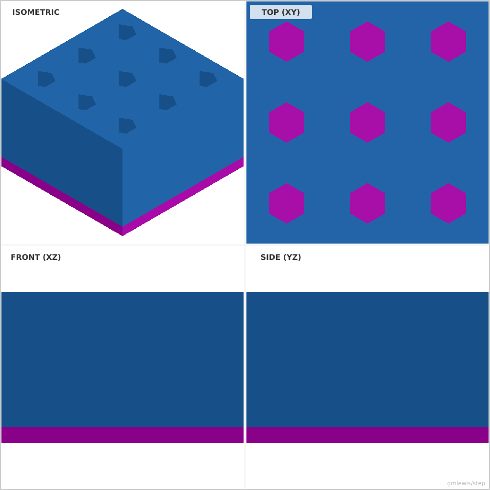

# 11 — Hex Bit Holder

This folder contains a **working example** that generates a STEP model for: A customizable bit organizer that arrays pockets from a CSV list of sizes.

The intent is that you can run the code here to emit a STEP file, open it in a CAD viewer, and/or import it into your slicer to 3D print and iterate.

## What this example demonstrates
- arraying features from data
- layout rules (spacing, margins)
- family generation from a single config
- parametric dimensions as first-class inputs

## Parameters to try
- `rows`
- `cols`
- `cellSize`
- `filletRadius`
- `chamferSize`

## Suggested extensions
- generate multiple sizes in one run
- add embossed labels for each pocket
- add a variant generator (small/medium/large)

---

### Variant 1

Command line: `./run-example.sh 11 --rows 2 --cols 4`

### Variant 2

Command line: `./run-example.sh 11 --rows 1 --cols 5 --spacing 8.5 --tolerance 0.05`

### Variant 3

Command line: `./run-example.sh 11 --rows 3 --cols 3 --spacing 15 --height 25`

