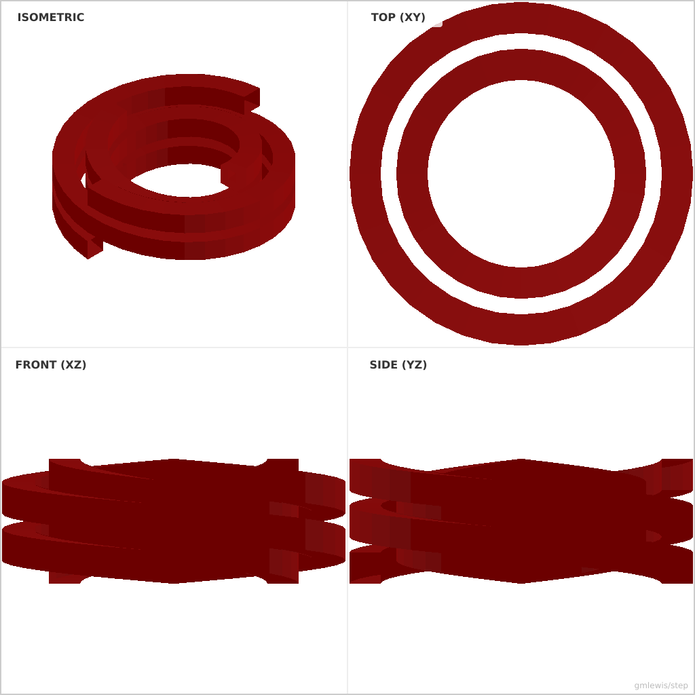
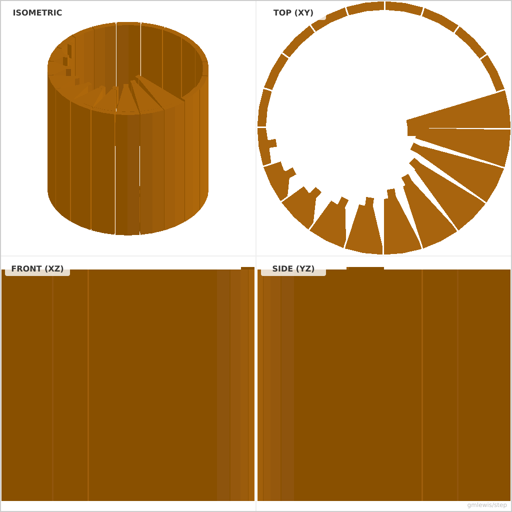
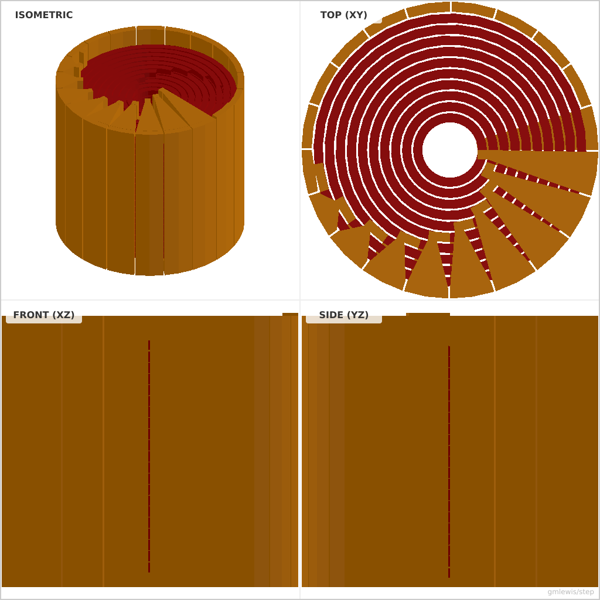

# 012-bifilar-electromagnet

Here's a YouTube video describing the process of how I came up with this model:

If the coils are wound such that the first and second coils share the same
radius but are wound next to each other (180-degrees out of phase), and then
the next pair of windings is completely rotated 180 degrees, then the
capacitance between the coils will be in both the radial direction _and_ the
axial direction!

Onshape design: https://cad.onshape.com/documents/b8320fedf1f1ea6028755ae8/w/50dfab2e1185c97711b860a6/e/20263eabe6f1f22cc85a5a09?renderMode=0&uiState=695414a99e93423471a30e60

*Example 12: The Bifilar Electromagnet, an invention of mine with interesting electrical properties.*

======================================================================

# License

Copyright 2019 Glenn M. Lewis. All Rights Reserved.

Licensed under the Apache License, Version 2.0 (the "License");
you may not use this file except in compliance with the License.
You may obtain a copy of the License at

    http://www.apache.org/licenses/LICENSE-2.0

Unless required by applicable law or agreed to in writing, software
distributed under the License is distributed on an "AS IS" BASIS,
WITHOUT WARRANTIES OR CONDITIONS OF ANY KIND, either express or implied.
See the License for the specific language governing permissions and
limitations under the License.

---

### Variant 1

Command line: `./run-example.sh 12 --nocage --numPairs 2 --wireGap 0.5 --vertTurns 1`

### Variant 2

Command line: `./run-example.sh 12 --nocoil --nowires --nosupport`

### Variant 3

Command line: `./run-example.sh 12 `

