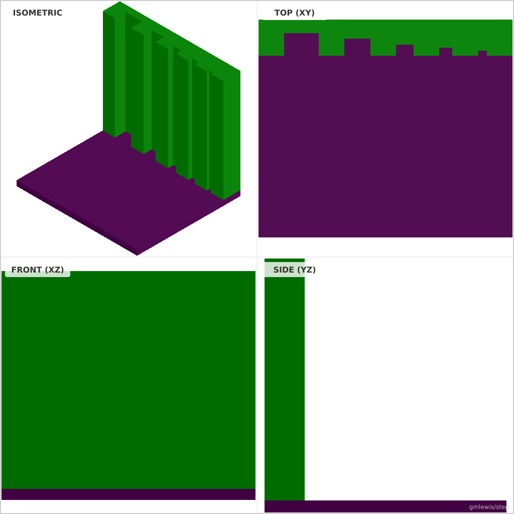
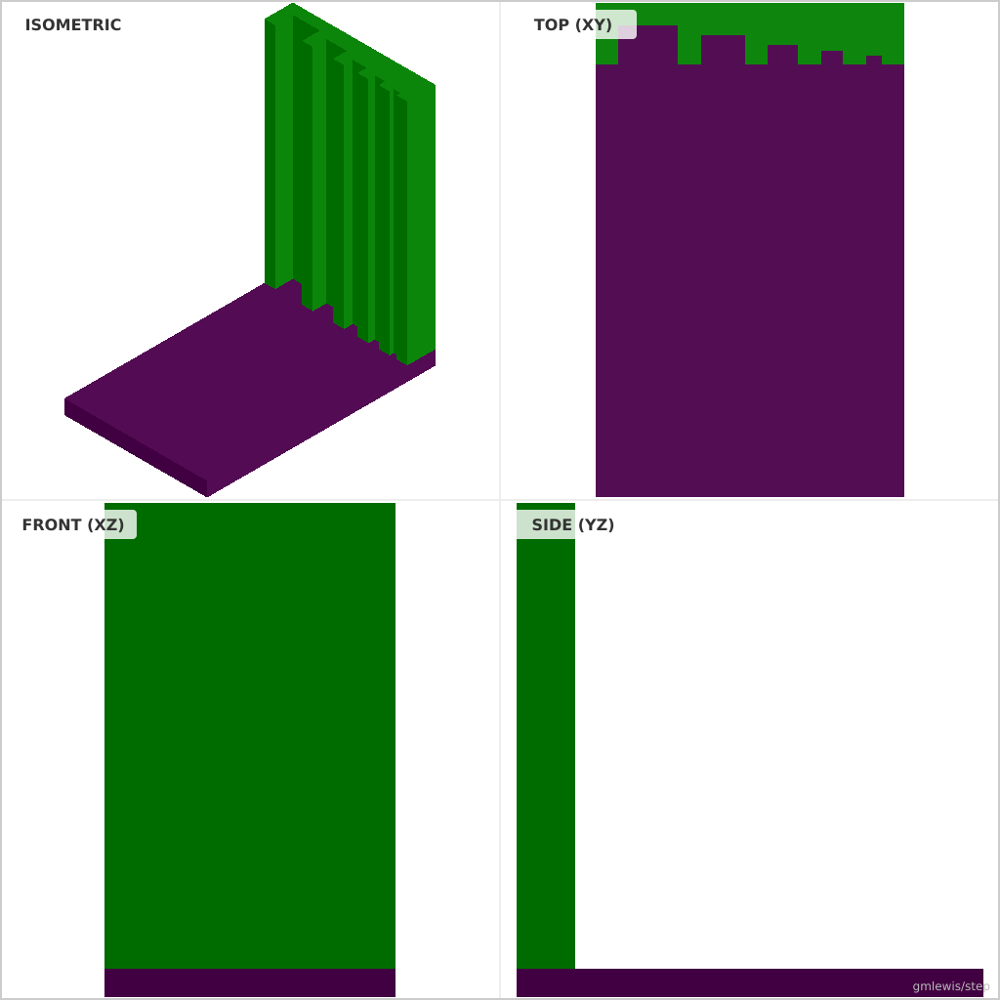

# 13 — O Ring Groove Gauge

This folder contains a **working example** that generates a STEP model for: A gauge block that prints different O-ring groove dimensions for fit testing.

The intent is that you can run the code here to emit a STEP file, open it in a CAD viewer, and/or import it into your slicer to 3D print and iterate.

## What this example demonstrates
- tolerance sweeps as code
- dimension-driven feature generation
- repeatable measurement artifacts
- parametric dimensions as first-class inputs

## Parameters to try
- `clearance`
- `interference`
- `stepCount`
- `filletRadius`
- `chamferSize`

## Suggested extensions
- emit a small “label plaque” with the chosen settings
- add a quick-fit calibration part alongside the main part
- add a variant generator (small/medium/large)

---

### Variant 1

Command line: `./run-example.sh 13 --length 60 --width 70`

### Variant 2

Command line: `./run-example.sh 13 --length 100 --width 80 --height 15`

### Variant 3

Command line: `./run-example.sh 13 --width 50 --baseHeight 5`

