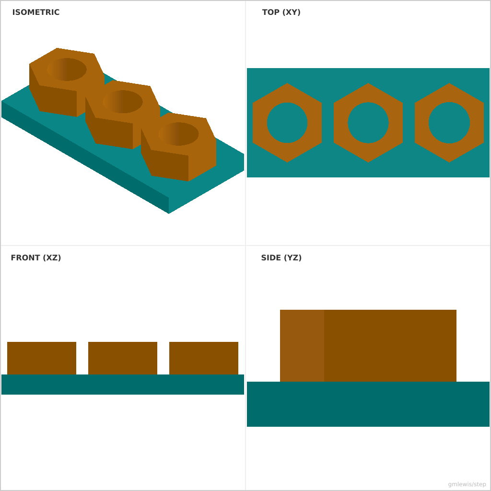

# 15 — Metric Threaded Rod Nut

This folder contains a **working example** that generates a STEP model for: A nut-like coupler body with correct clearances (thread modeling optional later).

The intent is that you can run the code here to emit a STEP file, open it in a CAD viewer, and/or import it into your slicer to 3D print and iterate.

## What this example demonstrates
- tolerance sweeps as code
- dimension-driven feature generation
- repeatable measurement artifacts
- mount geometry derived from standards

## Parameters to try
- `clearance`
- `interference`
- `stepCount`
- `holeSpacing`
- `mountThickness`

## Suggested extensions
- emit a small “label plaque” with the chosen settings
- add a quick-fit calibration part alongside the main part
- add cable routing features

---

### Variant 1

Command line: `./run-example.sh 15 --boltDiameter 8 --clearance 0.1`

### Variant 2

Command line: `./run-example.sh 15 --boltDiameter 10 --interference 0.1 --clearanceStep 0.1 --stepCount 3`

