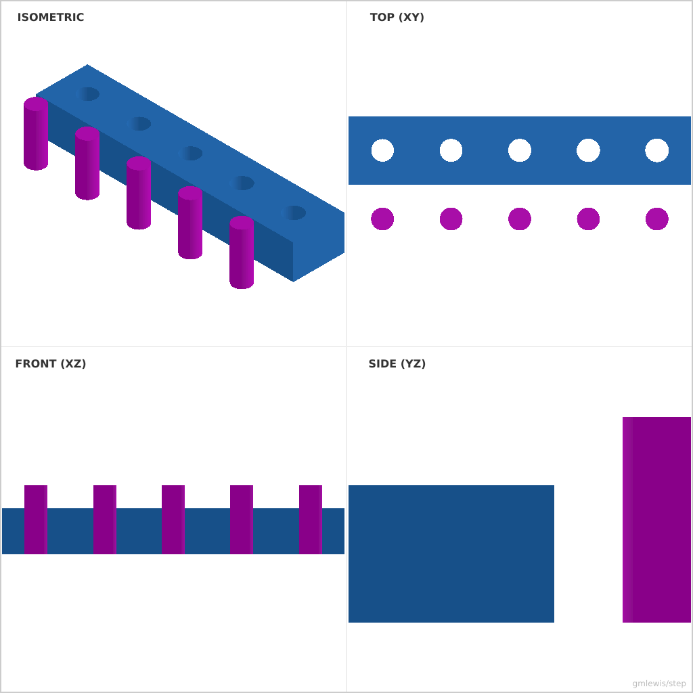
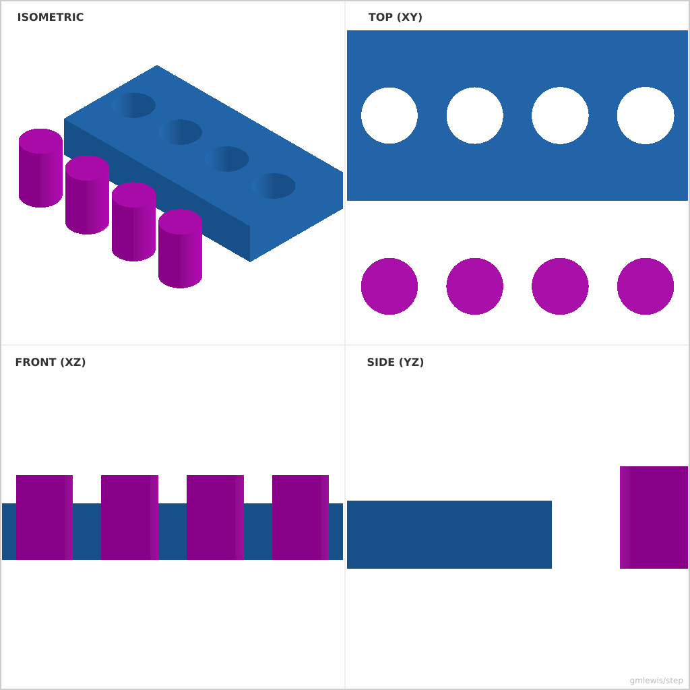

# 16 — Press Fit Pin Gauge

This folder contains a **working example** that generates a STEP model for: Pins and holes that step through interference values to calibrate press fits.

The intent is that you can run the code here to emit a STEP file, open it in a CAD viewer, and/or import it into your slicer to 3D print and iterate.

## What this example demonstrates
- tolerance sweeps as code
- dimension-driven feature generation
- repeatable measurement artifacts
- parametric dimensions as first-class inputs

## Parameters to try
- `clearance`
- `interference`
- `stepCount`
- `filletRadius`
- `chamferSize`

## Suggested extensions
- emit a small “label plaque” with the chosen settings
- add a quick-fit calibration part alongside the main part
- add a variant generator (small/medium/large)

---

### Variant 1

Command line: `./run-example.sh 16 --pinDiameter 5 --clearance 0.05`

### Variant 2

Command line: `./run-example.sh 16 --pinDiameter 10 --interference 0.1 --clearanceStep 0.05 --stepCount 4`

