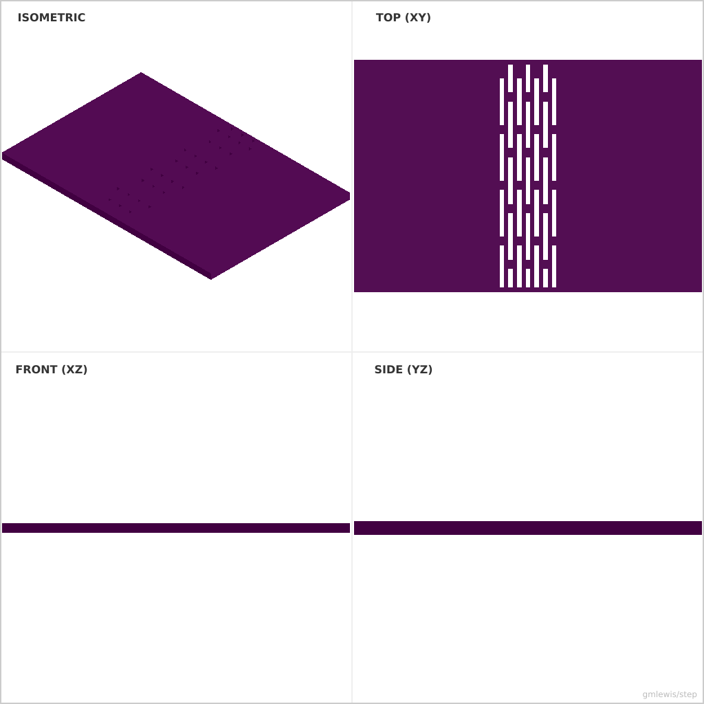
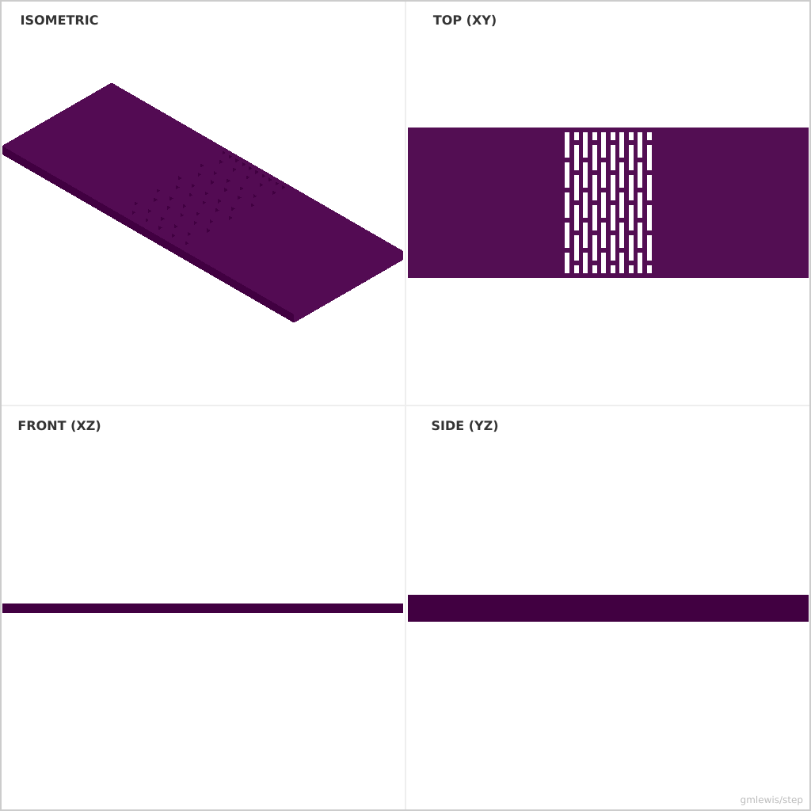

# 17 — Living Hinge Sample

This folder contains a **working example** that generates a STEP model for: A set of hinge patterns whose thickness and slot geometry are computed.

The intent is that you can run the code here to emit a STEP file, open it in a CAD viewer, and/or import it into your slicer to 3D print and iterate.

## What this example demonstrates
- spring features by construction
- print-friendly flexure geometry
- clearance tuning for reliable snaps
- transition solids (inlet→outlet)

## Parameters to try
- `snapClearance`
- `armThickness`
- `filletRadius`
- `inletSize`
- `outletSize`

## Suggested extensions
- generate a “fit ladder” variant automatically
- add chamfers to improve assembly feel
- add mounting flanges and bolt patterns

---

### Variant 1

Command line: `./run-example.sh 17 --thickness 2 --hingeWidth 15`

### Variant 2

Command line: `./run-example.sh 17 --width 30 --slotLength 5 --numRows 10`

