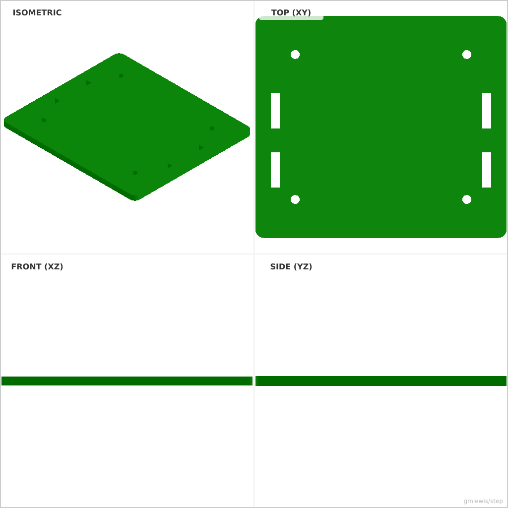
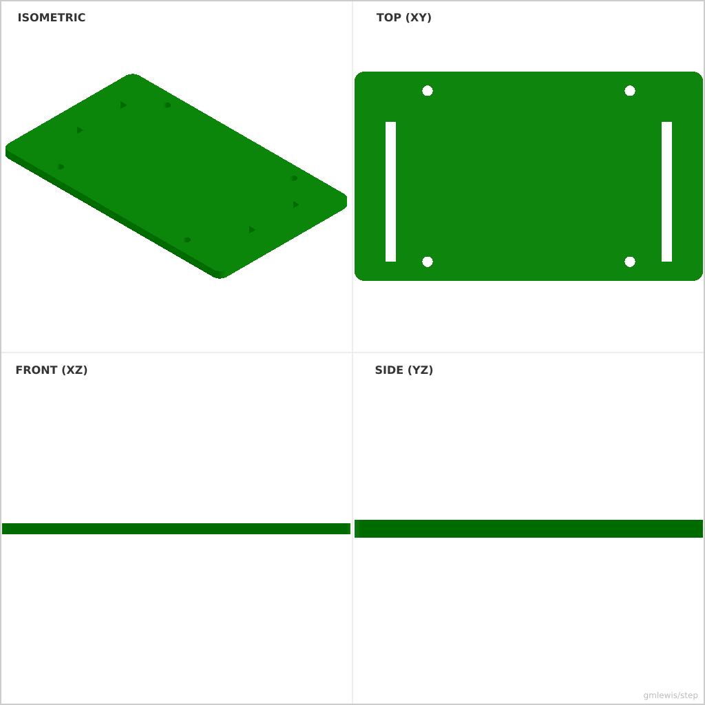

# 19 — Raspberry Pi Mount Plate

This folder contains a **working example** that generates a STEP model for: A mounting plate with programmable hole patterns and cable strain-relief geometry.

The intent is that you can run the code here to emit a STEP file, open it in a CAD viewer, and/or import it into your slicer to 3D print and iterate.

## What this example demonstrates
- mount geometry derived from standards
- patterned hole circles and slots
- strength-focused fillets/ribs
- measurement-driven parts

## Parameters to try
- `holeSpacing`
- `mountThickness`
- `slotLength`
- `thickness`
- `holeDiameter`

## Suggested extensions
- add cable routing features
- generate variants for multiple hardware standards
- add alignment pins/keys

---

### Variant 1

Command line: `./run-example.sh 19 --width 85 --length 75`

### Variant 2

Command line: `./run-example.sh 19 --width 100 --length 60 --slotLength 20`

