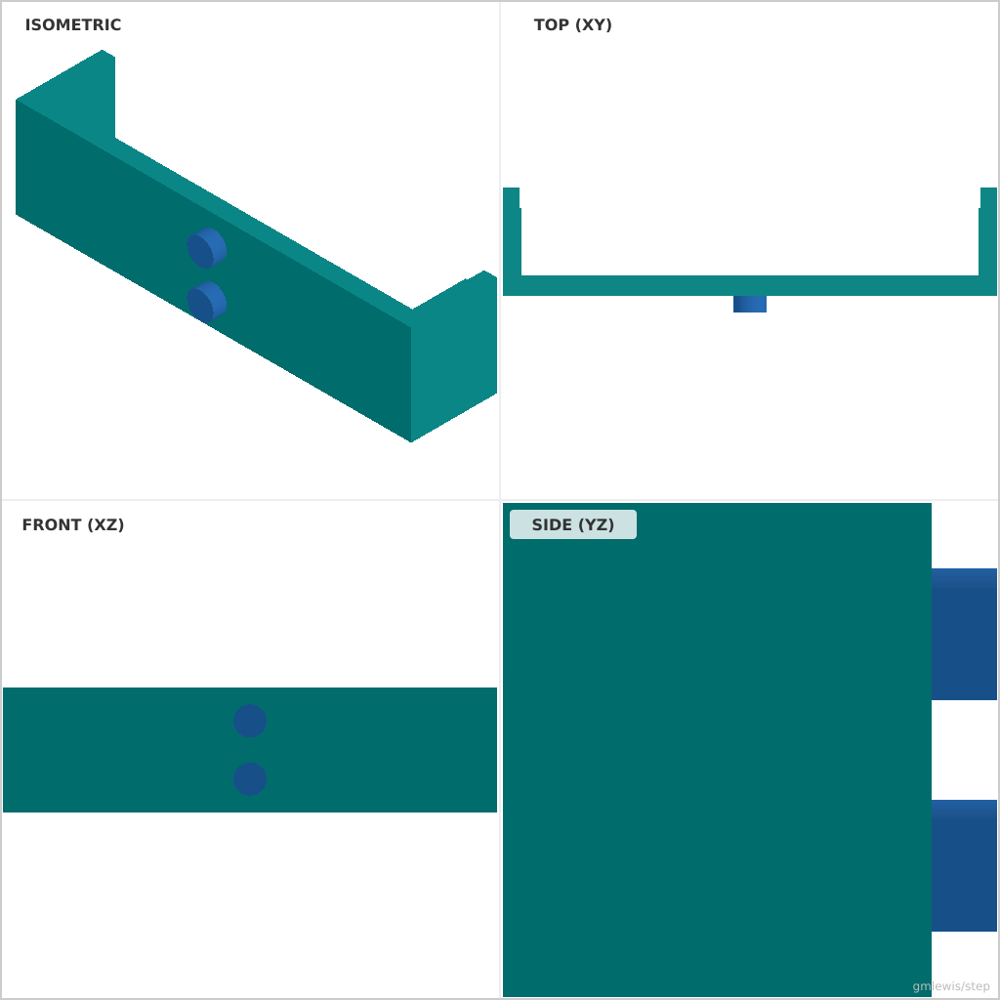
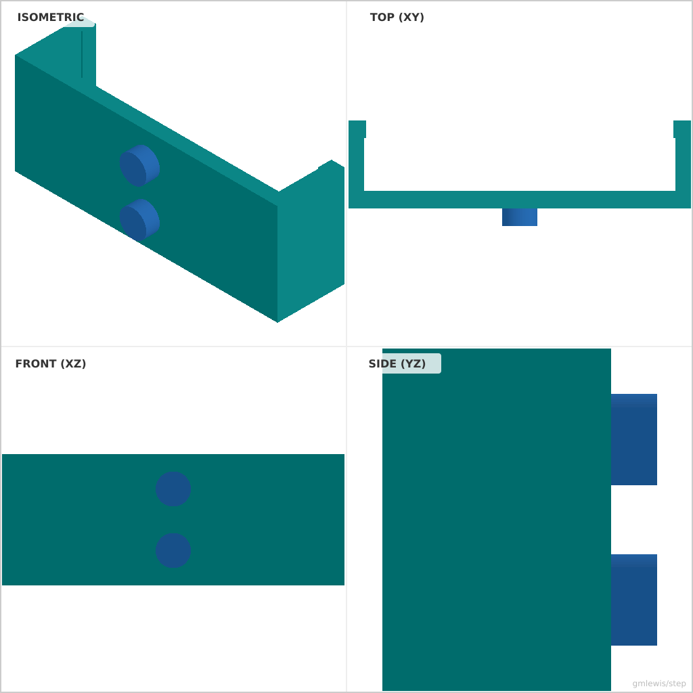

# 21 — Breadboard Rail Clips

This folder contains a **working example** that generates a STEP model for: Clips that hold breadboards to rails, generated for multiple breadboard sizes.

The intent is that you can run the code here to emit a STEP file, open it in a CAD viewer, and/or import it into your slicer to 3D print and iterate.

## What this example demonstrates
- spring features by construction
- print-friendly flexure geometry
- clearance tuning for reliable snaps
- precision seats/pockets

## Parameters to try
- `snapClearance`
- `armThickness`
- `filletRadius`
- `seatDiameter`
- `seatDepth`

## Suggested extensions
- generate a “fit ladder” variant automatically
- add chamfers to improve assembly feel
- add retention clips or covers

---

### Variant 1

Command line: `./run-example.sh 21 --width 54.5 --height 8`

### Variant 2

Command line: `./run-example.sh 21 --width 35 --height 6 --armThickness 2`

