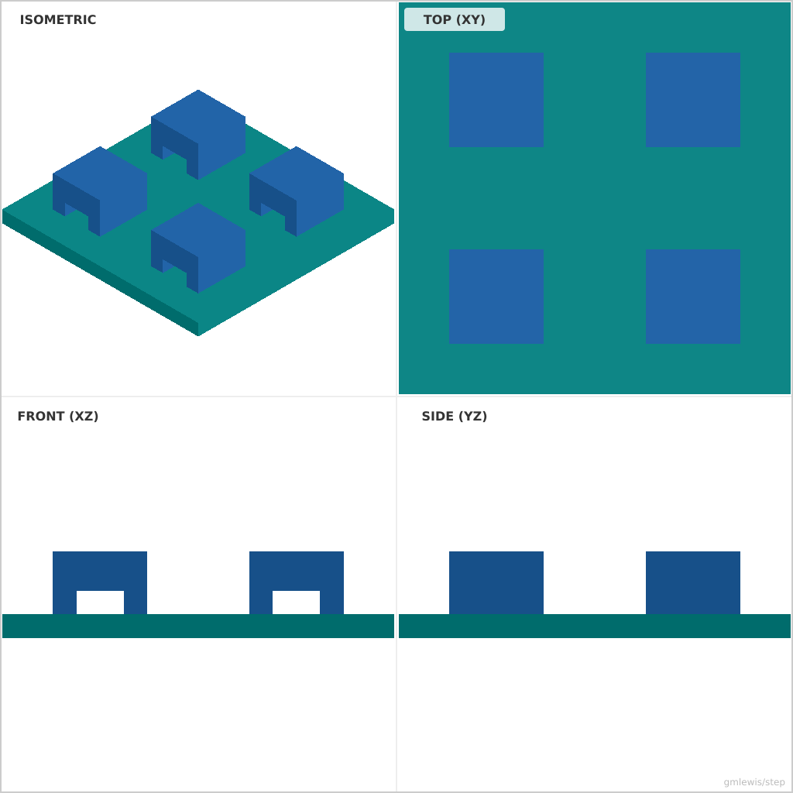
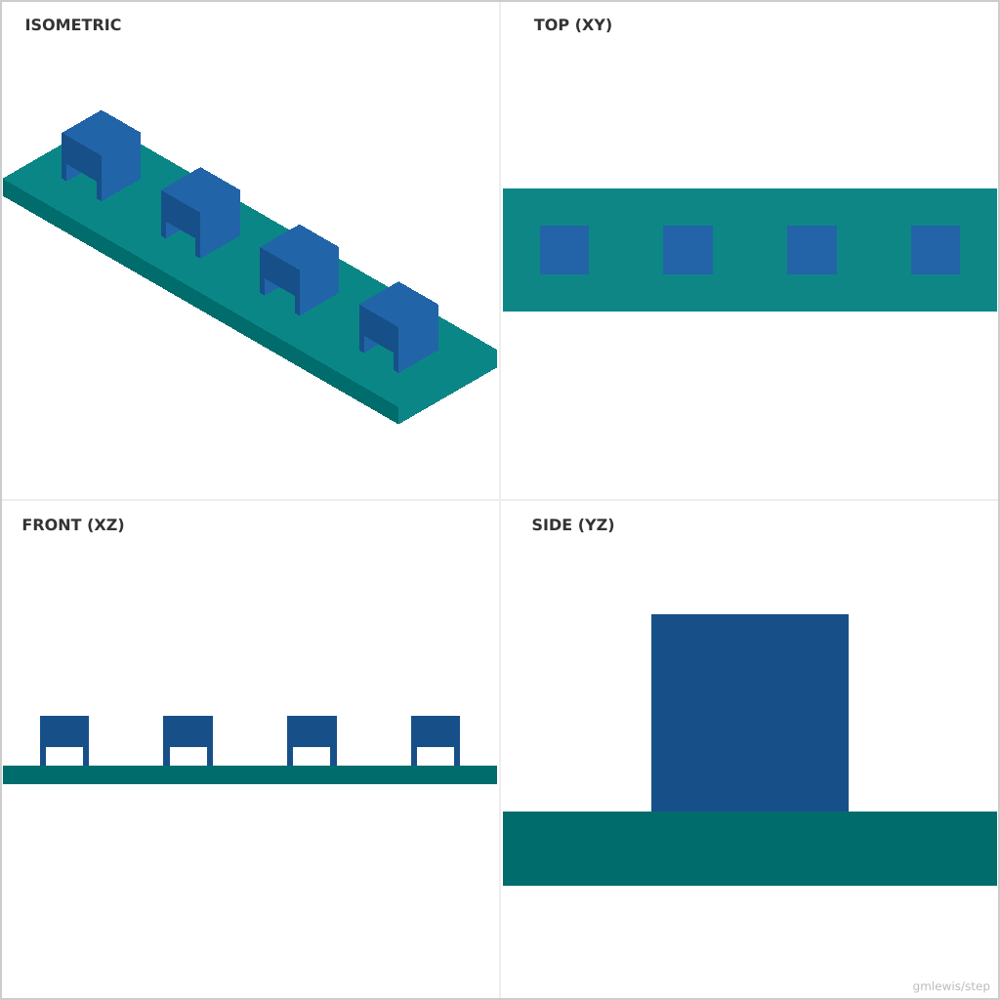

# 22 — Zip Tie Anchor Panel

This folder contains a **working example** that generates a STEP model for: A panel of zip-tie anchors with different slot geometries and strengths.

The intent is that you can run the code here to emit a STEP file, open it in a CAD viewer, and/or import it into your slicer to 3D print and iterate.

## What this example demonstrates
- grid-based component placement
- fastener-friendly geometry
- parametric dimensions as first-class inputs

## Parameters to try
- `rows`
- `cols`
- `spacing`
- `baseThickness`
- `anchorWidth`
- `anchorHeight`
- `slotWidth`
- `slotHeight`

## Suggested extensions
- add gasket grooves or light pipes
- add vent patterns tied to thermal needs
- add a variant generator (small/medium/large)

---

### Variant 1

Command line: `./run-example.sh 22 --rows 2 --cols 2`

### Variant 2

Command line: `./run-example.sh 22 --rows 1 --cols 4 --spacing 20 --anchorWidth 8`

