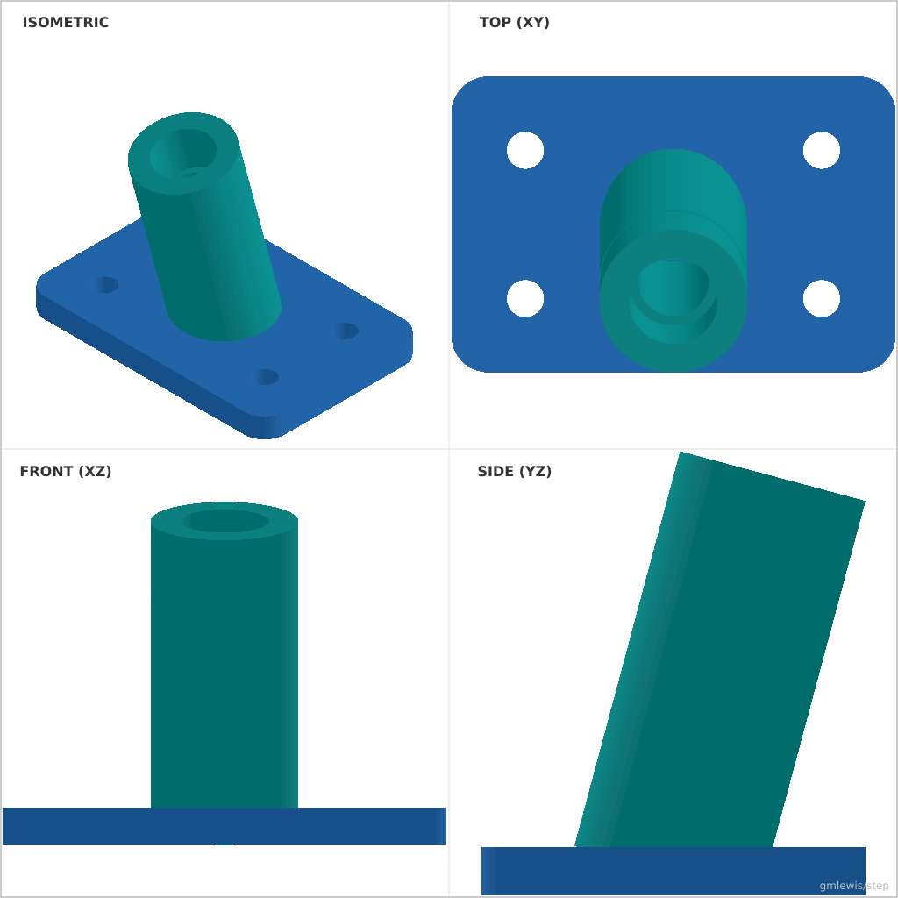
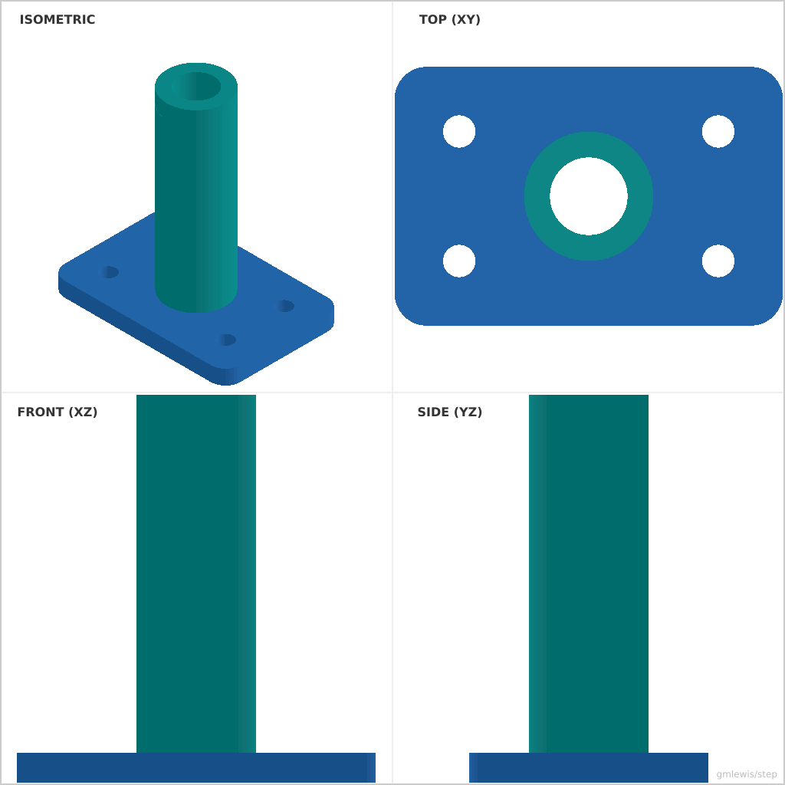

# 24 — Angled Drill Guide Block

This folder contains a **working example** that generates a STEP model for: A drill guide with configurable angles and bushing seat geometry.

The intent is that you can run the code here to emit a STEP file, open it in a CAD viewer, and/or import it into your slicer to 3D print and iterate.

## What this example demonstrates
- precision seats/pockets
- repeatable fits for standard parts
- parameter sweeps for real-world tuning
- measurement-driven parts

## Parameters to try
- `seatDiameter`
- `seatDepth`
- `clearance`
- `thickness`
- `holeDiameter`

## Suggested extensions
- add retention clips or covers
- add test coupons for your printer/material
- add alignment pins/keys

---

### Variant 1

Command line: `./run-example.sh 24 --angle 15 --seatDepth 10`

### Variant 2

Command line: `./run-example.sh 24 --angle 0 --holeDiameter 12 --height 60`

