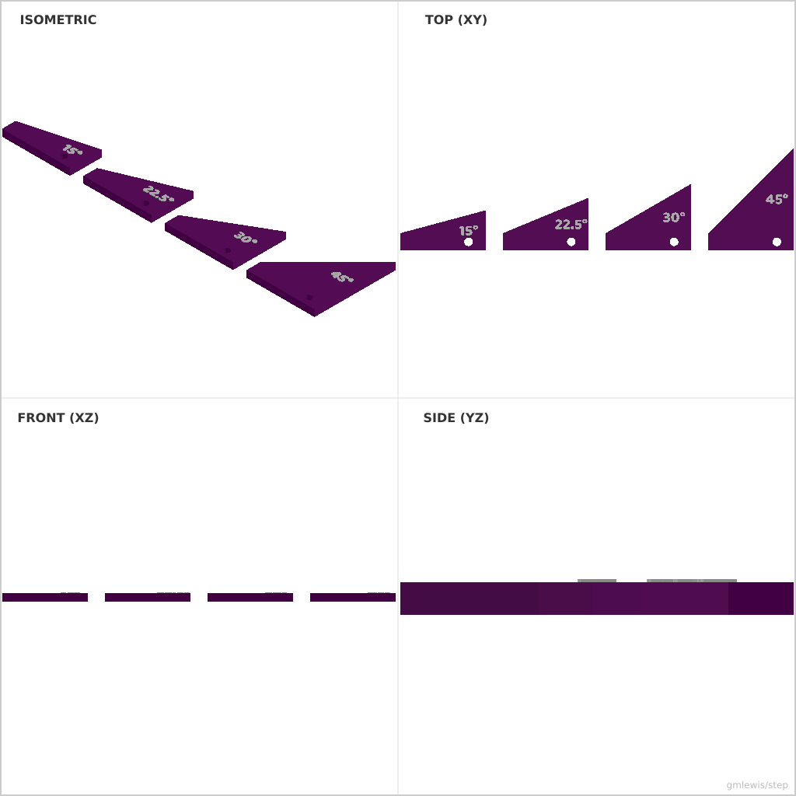
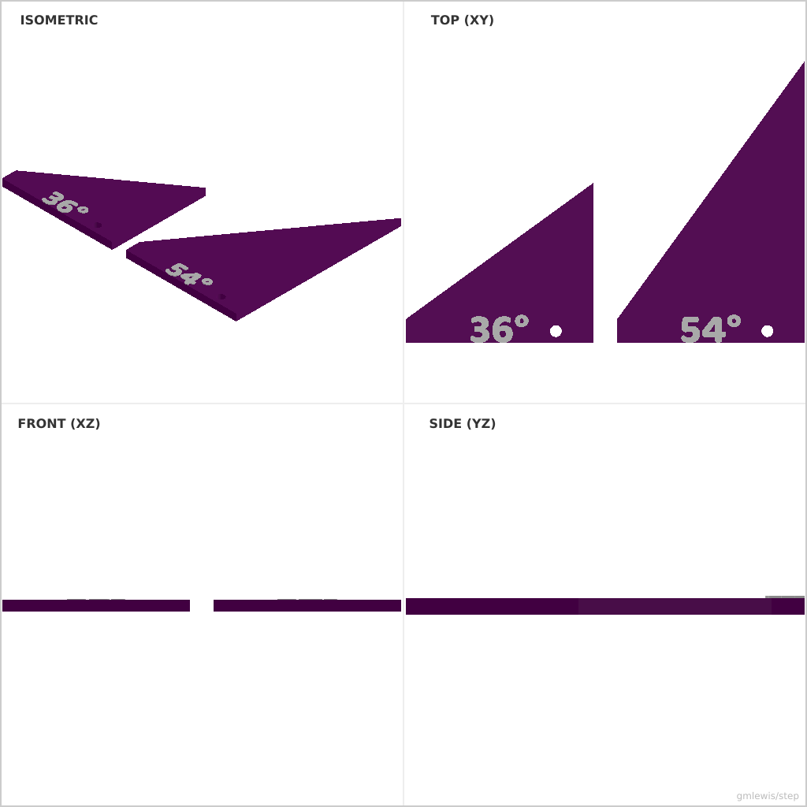

# 25 — Miter Saw Angle Template

This folder contains a **working example** that generates a STEP model for: Printable angle templates computed from desired joint geometry.

The intent is that you can run the code here to emit a STEP file, open it in a CAD viewer, and/or import it into your slicer to 3D print and iterate.

## What this example demonstrates
- measurement-driven parts
- repeatable hole patterns
- clearance-aware mating geometry
- parametric dimensions as first-class inputs

## Parameters to try
- `thickness`
- `holeDiameter`
- `edgeMargin`
- `filletRadius`
- `chamferSize`

## Suggested extensions
- add alignment pins/keys
- emit left/right mirrored variants
- add a variant generator (small/medium/large)

---

### Variant 1

Command line: `./run-example.sh 25 --angles 15,22.5,30,45`

### Variant 2

Command line: `./run-example.sh 25 --size 80 --angles 36,54`

