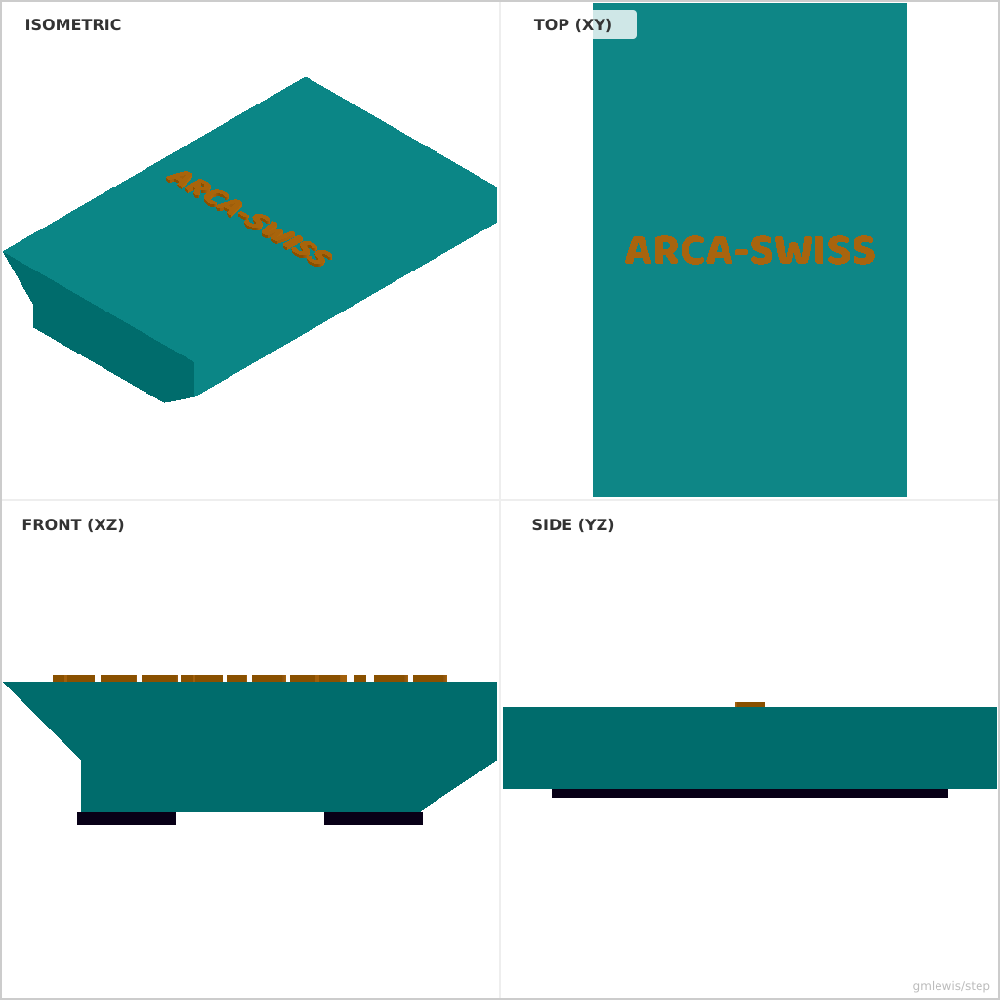
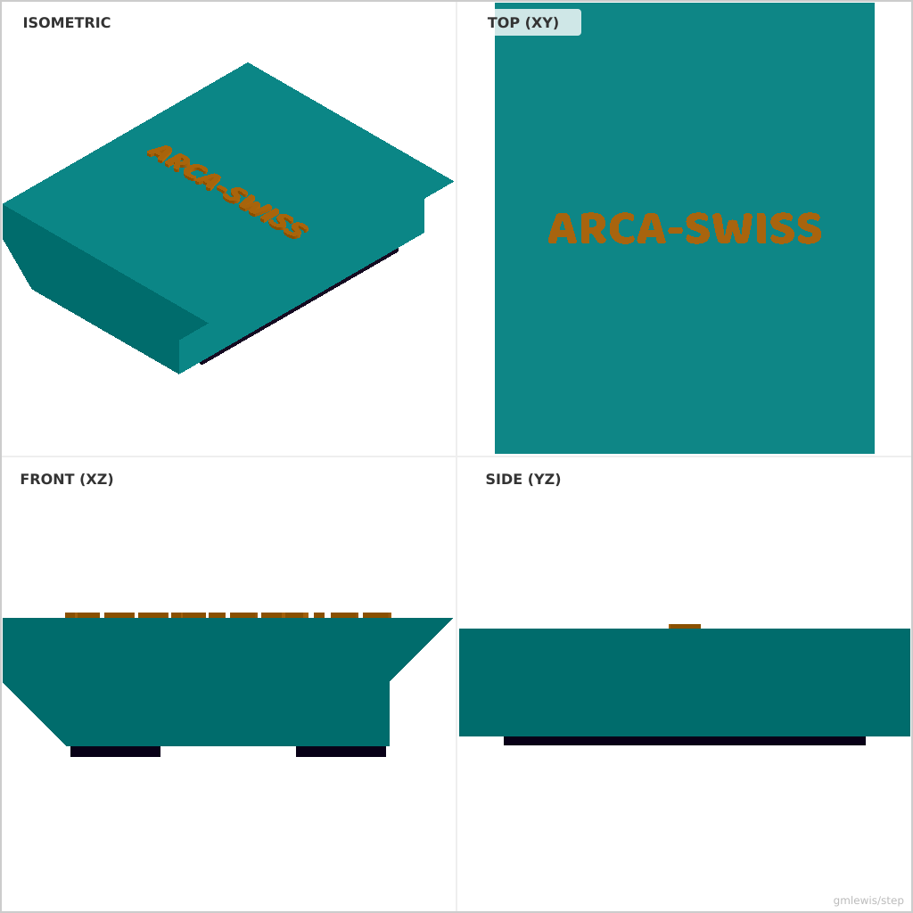

# 27 — Camera Tripod Adapter

This folder contains a **working example** that generates a STEP model for: A parametric Arca-Swiss compatible camera tripod mounting plate.

The intent is that you can run the code here to emit a STEP file, open it in a CAD viewer, and/or import it into your slicer to 3D print and iterate.

## What this example demonstrates
- Complex 2D profile extrusion with tapered sides (Arca-Swiss dovetail)
- Assembly of multiple parts (plate body, rubber pads, and embossed text)
- Coordinate system rotation and translation for proper orientation

## Parameters to try
- `--width <mm>`: Plate width at the dovetail base (default: 38.0)
- `--length <mm>`: Plate length (default: 50.0)
- `--height <mm>`: Total plate height (default: 10.0)

## Run

- From the root: `./examples/run-example.sh 27 -o plate.step`

## Suggested extensions
- Add a 1/4"-20 threaded hole or a mounting slot
- Add weight reduction pockets on the underside
- Add mounting safety pins to prevent the plate from sliding out

---

### Variant 1

Command line: `./run-example.sh 27 --length 60`

### Variant 2

Command line: `./run-example.sh 27 --width 42 --height 12`

