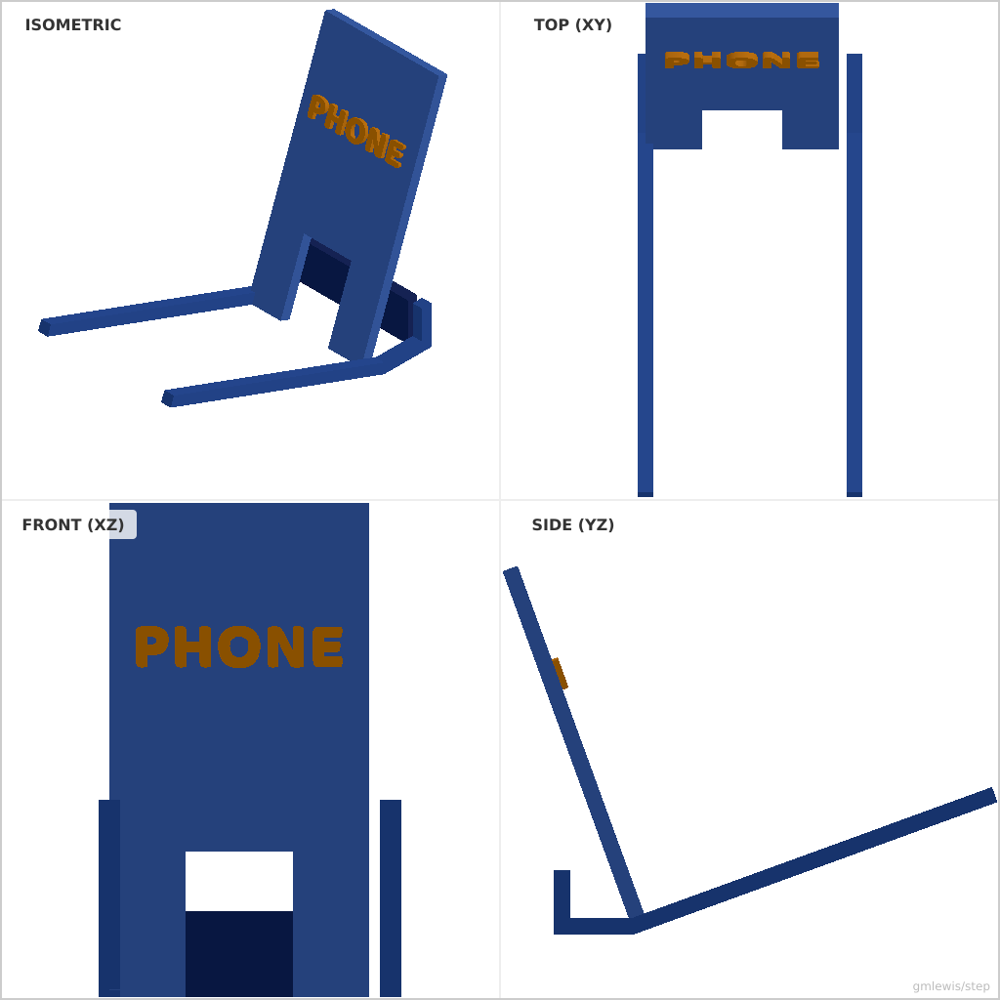
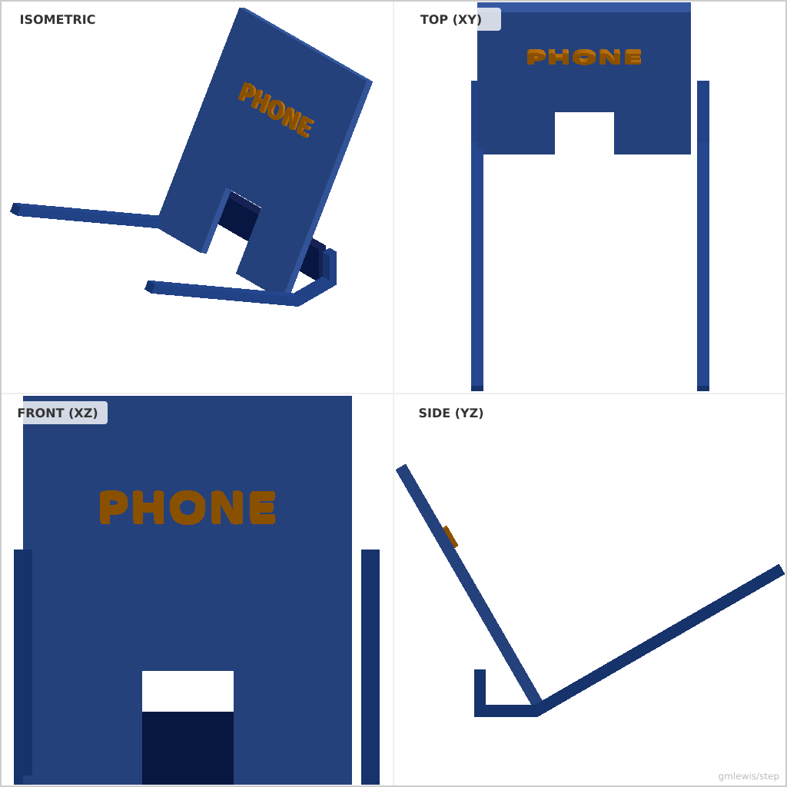

# 28 — Phone Stand Parametric

This folder contains a **working example** that generates a STEP model for: A parametric phone stand generator.

The intent is that you can run the code here to emit a STEP file, open it in a CAD viewer, and/or import it into your slicer to 3D print and iterate.

## What this example demonstrates
- Assembly of multiple parts (side supports, back plate, front lip)
- Coordinate system rotation and translation for angled components
- Parametric design driven by device thickness and viewing angle

## Parameters to try
- `--phoneThickness <mm>`: Thickness of the phone/tablet (default: 12.0)
- `--viewAngle <degrees>`: Viewing angle from vertical (default: 20.0)
- `--width <mm>`: Total width of the stand (default: 70.0)
- `--height <mm>`: Total height of the back support (default: 120.0)
- `--thickness <mm>`: Material thickness (default: 5.0)

## Run

- From the root: `./examples/run-example.sh 28 -o stand.step`

## Suggested extensions
- Add a dedicated cable notch in the back plate
- Add rubber feet on the bottom
- Make the stand foldable

---

### Variant 1

Command line: `./run-example.sh 28 --phoneThickness 10`

### Variant 2

Command line: `./run-example.sh 28 --viewAngle 30 --width 100`

