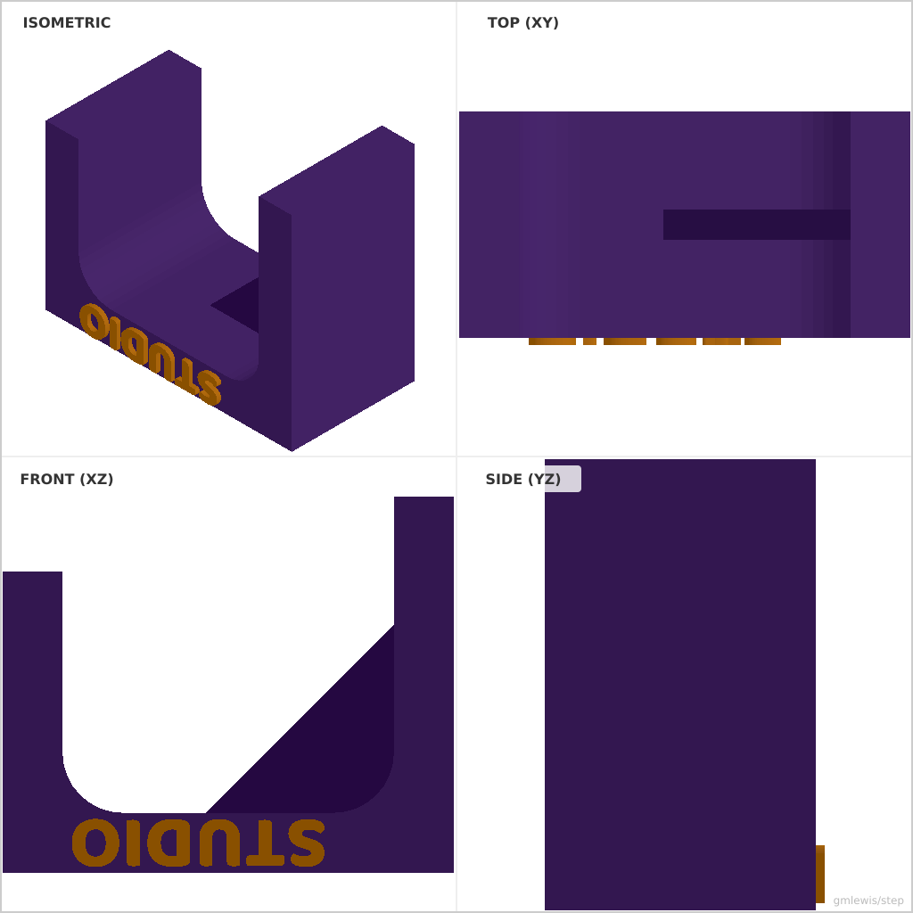

# 29 — Headphone Hook

This folder contains a **working example** that generates a STEP model for: A parametric wall-mounted headphone hook.

The intent is that you can run the code here to emit a STEP file, open it in a CAD viewer, and/or import it into your slicer to 3D print and iterate.

## What this example demonstrates
- Complex 2D profile construction using `pts.push` and `pts.push_iter`
- Computed fillets using `@cad.Profile2D::arc` for smoother transitions and strength
- Multi-part assembly including a reinforcing rib and embossed branding

## Parameters to try
- `--width <mm>`: Width of the hook (default: 30.0)
- `--armLength <mm>`: Length of the horizontal arm (default: 60.0)
- `--hookHeight <mm>`: Height of the front retaining lip (default: 25.0)
- `--mountHeight <mm>`: Height of the mounting plate (default: 50.0)
- `--thickness <mm>`: Main material thickness (default: 6.0)
- `--filletRadius <mm>`: Radius of the inner fillets (default: 8.0)

## Run

- From the root: `./examples/run-example.sh 29 -o hook.step`

## Suggested extensions
- Add screw holes to the mounting plate
- Add a cable management clip on the side
- Use a T-beam profile for the arm for extreme strength

---

### Variant 1

Command line: `./run-example.sh 29 --width 40 --armLength 80`

### Variant 2

Command line: `./run-example.sh 29 --hookHeight 40 --thickness 8`

