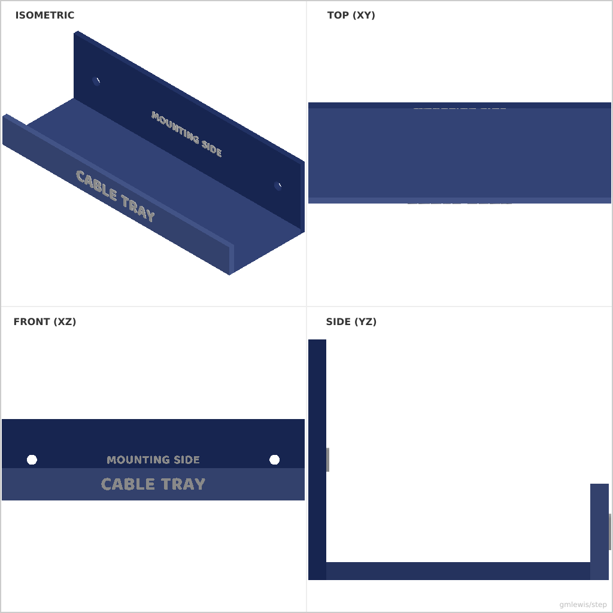
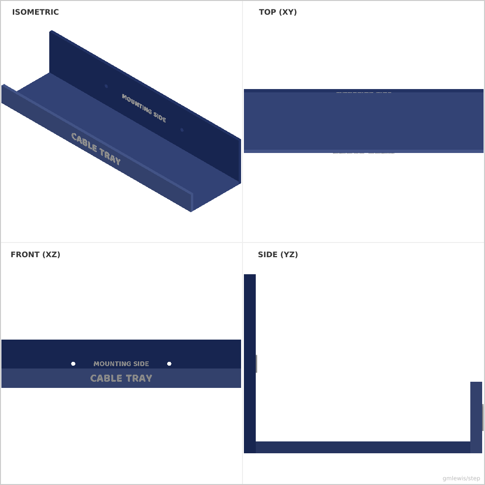

# 30 — Desk Cable Tray

This folder contains a **working example** that generates a STEP model for: A parametric under-desk cable management tray.

The intent is that you can run the code here to emit a STEP file, open it in a CAD viewer, and/or import it into your slicer to 3D print and iterate.

## What this example demonstrates
- Complex J-profile construction with fillets
- Coordinate system transformations (rotations/translations)
- Assembly of multiple parts (tray, mounting holes)
- Embossed text branding on a face

## Parameters to try
- `--length`: Total length of the tray (default: 200.0)
- `--width`: Width/depth of the tray (default: 60.0)
- `--height`: Total height of the tray (default: 50.0)
- `--thickness`: Material thickness (default: 3.0)
- `--mountHoleSpacing`: Spacing between mounting holes (default: 150.0)

## Suggested extensions
- Add more mounting holes for longer trays
- Add cable tie slots along the bottom
- Add a back plate for easier mounting

---

### Variant 1

Command line: `./run-example.sh 30 --length 150 --width 50 --height 40`

### Variant 2

Command line: `./run-example.sh 30 --length 300 --width 80 --height 60 --thickness 4`

