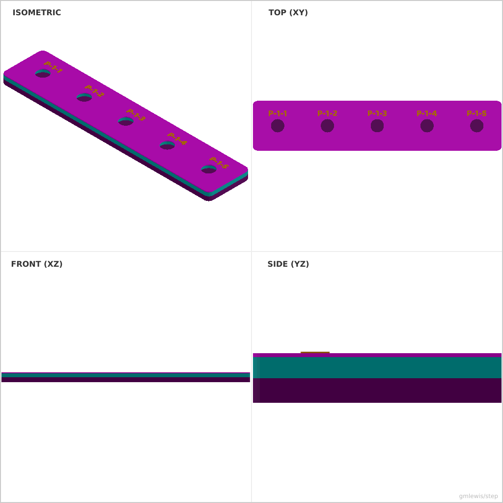
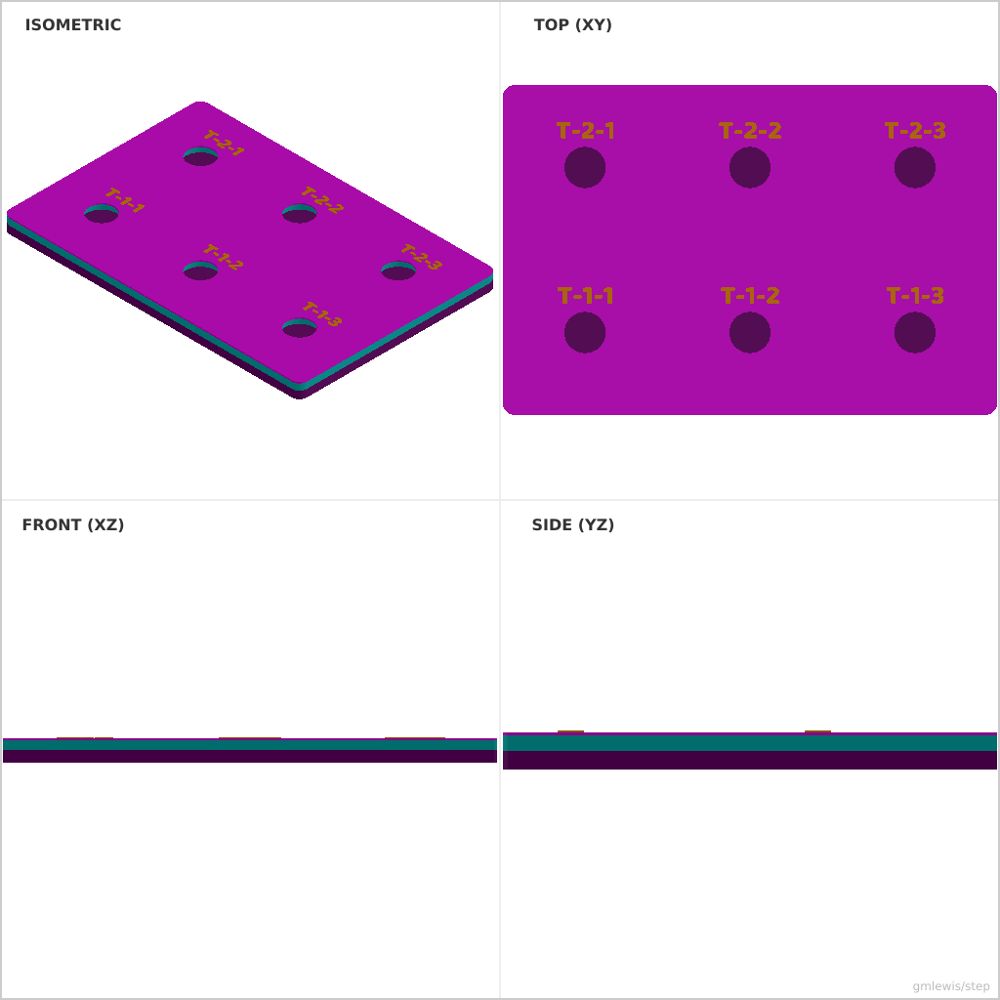

# 31 — Magnetic Tool Holder Strip

This folder contains a **working example** that generates a STEP model for: A strip with magnet pockets, spacing rules, and configurable retention lips.

The intent is that you can run the code here to emit a STEP file, open it in a CAD viewer, and/or import it into your slicer to 3D print and iterate.

## What this example demonstrates
- arraying features from data
- layout rules (spacing, margins)
- family generation from a single config
- parametric dimensions as first-class inputs

## Parameters to try
- `rows`
- `cols`
- `cellSize`
- `filletRadius`
- `labelPrefix`

## Suggested extensions
- generate multiple sizes in one run
- add embossed labels for each pocket
- add a variant generator (small/medium/large)

---

### Variant 1

Command line: `./run-example.sh 31 --rows 1 --cols 5 --labelPrefix P`

### Variant 2

Command line: `./run-example.sh 31 --rows 2 --cols 3 --cellSize 40 --magnetDiameter 12 --labelPrefix T`

