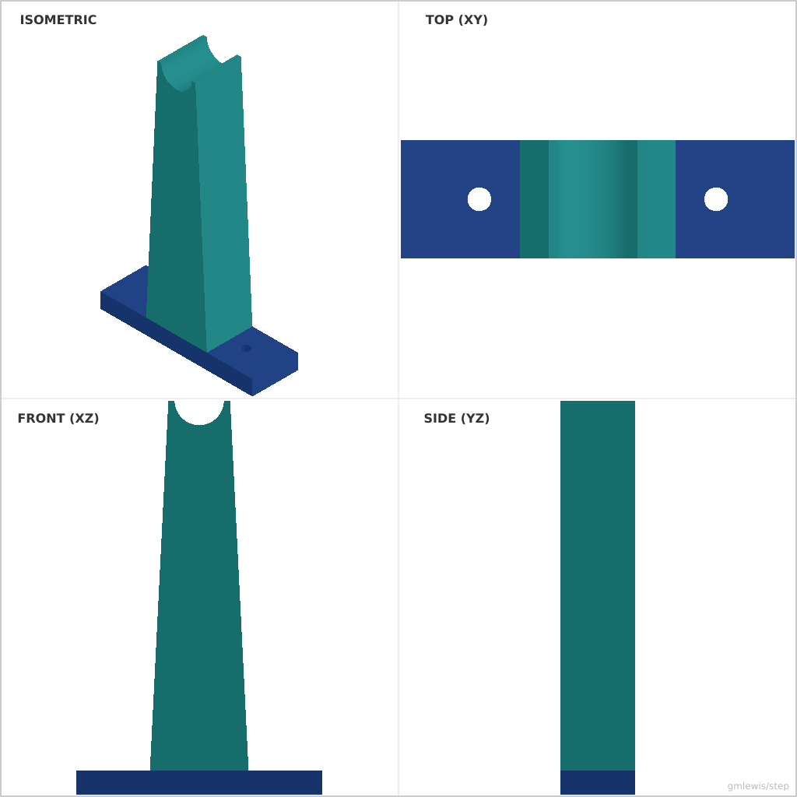
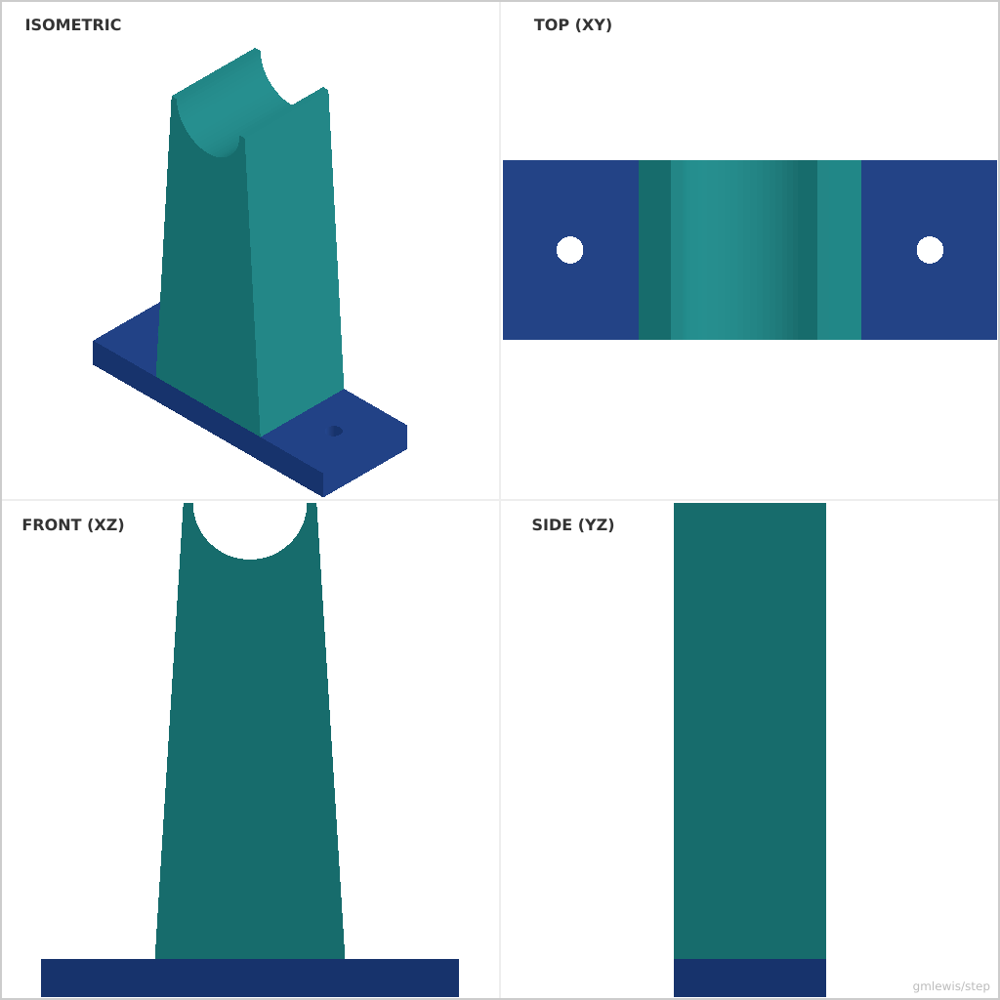

# 32 — Spool Holder Bracket

This folder contains a **working example** that generates a STEP model for: A bracket that adapts to multiple spool widths and axle diameters.

The intent is that you can run the code here to emit a STEP file, open it in a CAD viewer, and/or import it into your slicer to 3D print and iterate.

## What this example demonstrates
- multi-part assembly with overlapping solids
- concave profile features using `Profile2D::arc`
- complex side-view extrusion combined with top-view extrusion
- parametric mounting hole patterns

## Parameters to try
- `baseLength`: Length of the mounting base.
- `armHeight`: Height of the arm from the base.
- `axleDia`: Diameter of the spool axle to support.
- `armBaseThickness`: Thickness of the arm at the bottom (for strength).
- `armTopThickness`: Thickness of the arm at the top.
- `holeSpacing`: Distance between mounting holes.

## Suggested extensions
- add reinforcement gussets between the base and arm
- add text labels for the axle diameter using `add_text_on_face`
- generate a matching pair of brackets with different heights
- add a locking mechanism or cap for the axle cradle

---

### Variant 1

Command line: `./run-example.sh 32 --baseLength 100 --armHeight 150`

### Variant 2

Command line: `./run-example.sh 32 --axleDia 30 --armWidth 40 --armBaseThickness 50 --armTopThickness 35 --holeSpacing 80 --baseLength 110`

