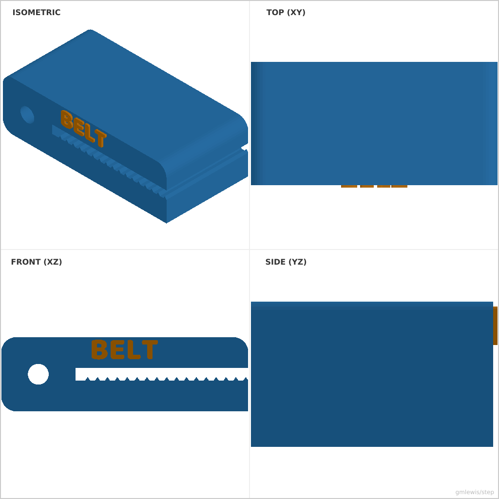

# 34 — Belt Tensioner Block

This folder contains a **working example** that generates a STEP model for: A tensioner block with computed belt path and integrated GT2-style teeth.

The intent is that you can run the code here to emit a STEP file, open it in a CAD viewer, and/or import it into your slicer to 3D print and iterate.

## What this example demonstrates
- complex profile generation with repeating patterns (teeth)
- integrated belt path cutout vs. separate hole approach
- parametric alignment of bolt holes and belt paths
- beautiful blue aesthetic with engraved labels

## Parameters to try
- `length`: Total length of the block.
- `width`: Width of the extrusion.
- `height`: Height of the block.
- `beltThickness`: Clearance for the belt.
- `toothPitch`: Spacing for belt teeth (default 2.0mm for GT2).
- `boltDia`: Diameter for the tensioning bolt hole.

## Suggested extensions
- add a second bolt hole for dual-screw tensioning
- add a matching "cap" part that clamps the belt
- add text on the side faces indicating the belt direction

---

### Variant 1

Command line: `./run-example.sh 34 --length 50 --width 25`

### Variant 2

Command line: `./run-example.sh 34 --height 20 --beltThickness 2.0 --boltDia 5.2`

