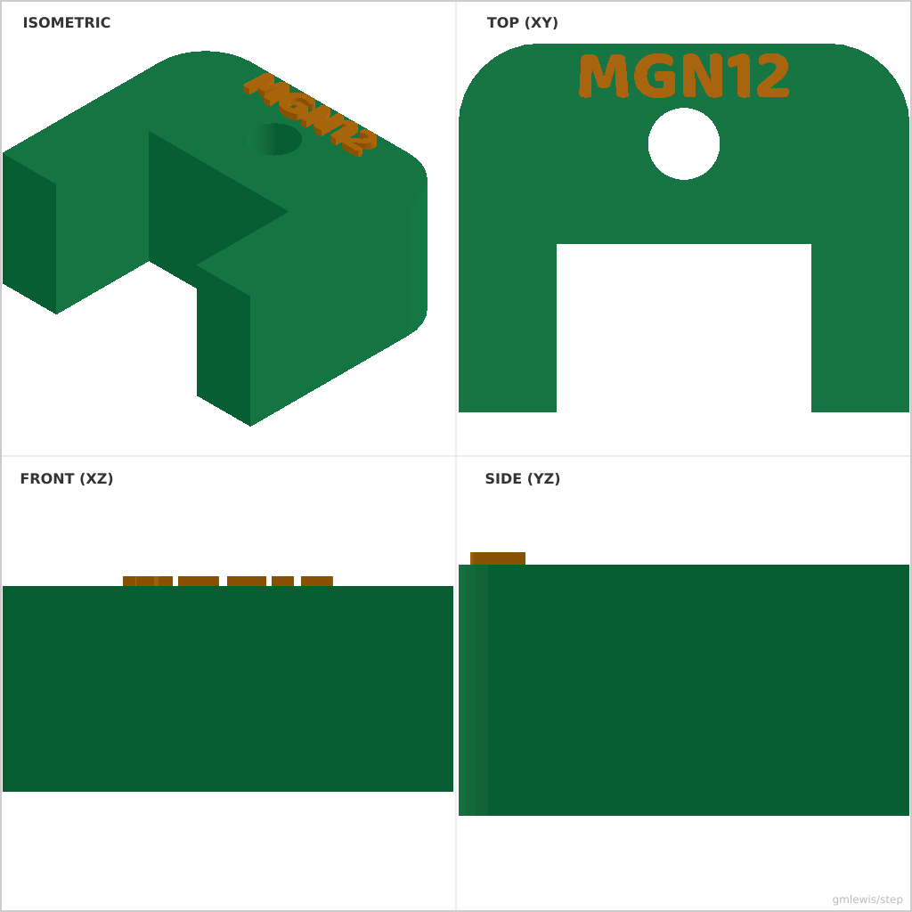
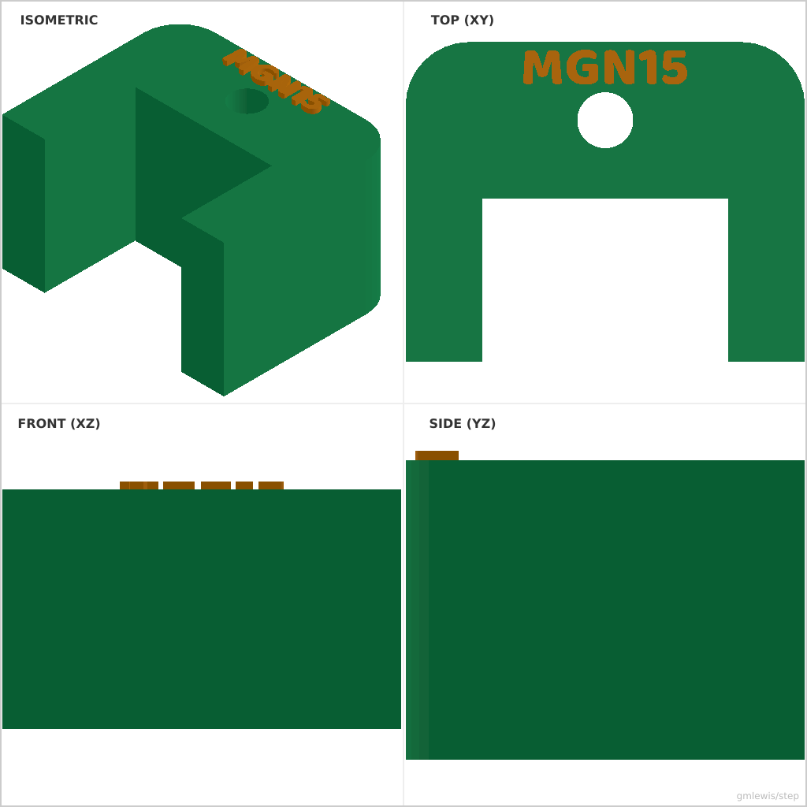

# 35 — Linear Rail Endcap

This folder contains a **working example** that generates a STEP model for: Endcaps that fit common rail profiles, with optional mounting holes.

The intent is that you can run the code here to emit a STEP file, open it in a CAD viewer, and/or import it into your slicer to 3D print and iterate.

## What this example demonstrates
- precision rail profile fitting
- integrated mounting features (fastener seats)
- single-profile complex geometry construction
- emerald green aesthetic with engraved labels

## Parameters to try
- `railWidth`: Width of the linear rail (e.g. 12 for MGN12).
- `railHeight`: Height of the linear rail.
- `thickness`: Total thickness of the endcap.
- `clearance`: Tolerance added to the rail pocket.
- `seatDiameter`: Diameter for the mounting screw.

## Suggested extensions
- add a second mounting hole for dual-screw attachment
- add a wiper groove for a rubber or felt insert
- add text on the top face with the printer model name

---

### Variant 1

Command line: `./run-example.sh 35 --railWidth 12 --railHeight 8`

### Variant 2

Command line: `./run-example.sh 35 --railWidth 15 --railHeight 10 --thickness 15`

