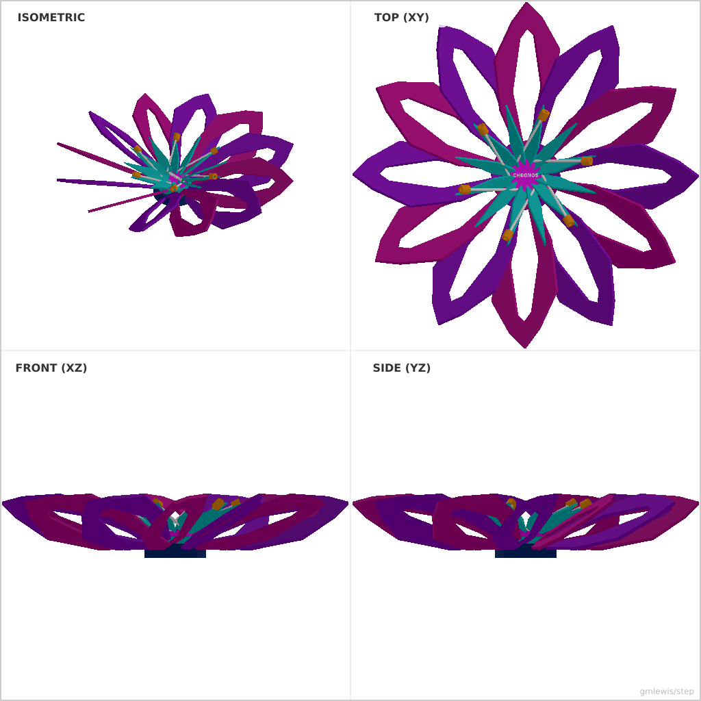
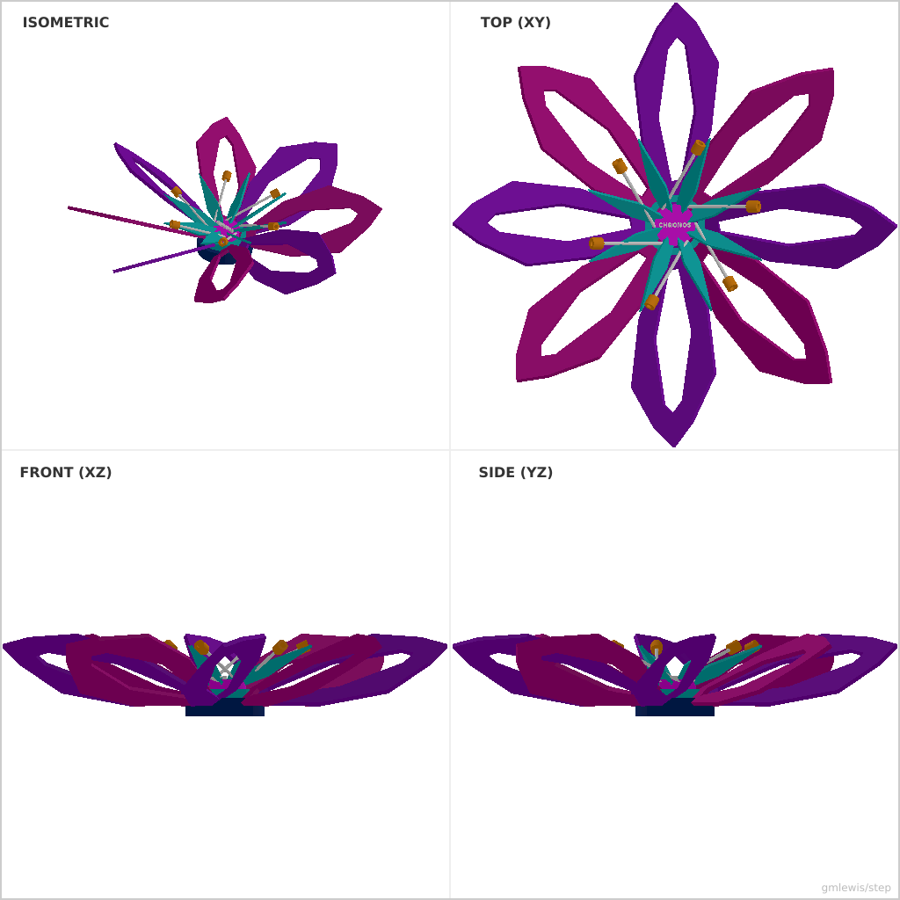

# Example 100: Chronos Gear-Flower

A model that demonstrates the power of parametric modeling.
It features:
- Radial symmetry with complex nested profiles.
- Concentric multi-layered hub assembly.
- Detailed petals with internal cutouts.
- Engraved text on 3D surfaces.

## Usage

```bash
./run-example.sh 100 -o flower.step
```

---

### Variant 1

Command line: `./run-example.sh 100 --petals 12`



### Variant 2

Command line: `./run-example.sh 100 --petals 8 --tx 50`


